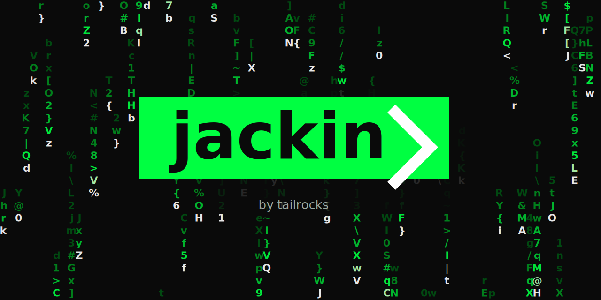

# jackin❯



> [!WARNING]
> 🚧 jackin❯ is in active early development.
>
> jackin❯ is not production-ready. We are actively refining the core concept, runtime integrations, CLI/TUI workflows, schemas, and documentation, and that will introduce major breaking changes before a stable release. Features may be redesigned, replaced, or removed while we find the shape that makes sense. Early adopters are welcome, but the priority right now is concept quality and fast iteration rather than freezing today's behavior. The docs track the rolling preview channel; open issues and roadmap feedback are welcome, but do not treat the current feature set as a compatibility promise.

Run AI coding agents at full speed inside isolated containers: scoped access, per-agent state, and host boundaries that stay visible.

jackin❯ is the **ecosystem layer around** AI coding agents — not another agent itself. It runs many agents in parallel, each in its own container, with its own file access, tool profile, and credentials. Every agent runtime ([Claude Code](https://docs.anthropic.com/en/docs/claude-code) `--dangerously-skip-permissions`, [Codex](https://github.com/openai/codex) YOLO, [Amp](https://ampcode.com), Kimi, OpenCode, Grok, and the next ones to come) is most productive at full speed — and full speed against your host machine is risky. jackin❯ moves the boundary off the host, so the runtime can stay fast.

Documentation: <https://jackin.tailrocks.com/>

## Install

```sh
brew tap jackin-project/tap
brew install jackin@preview
```

Or [build from source](https://jackin.tailrocks.com/getting-started/installation/) if you prefer. For source
checkouts, run `mise install` first to install the pinned toolchain and dev tools.

## Quick Start

The simplest way to use jackin❯ is the **operator console** — an interactive TUI that picks workspaces, roles, and agents for you:

```sh
jackin
```

(Or `jackin console` to be explicit.) The console is the daily driver and covers the common cases of every other command.

If you'd rather see the isolation model in action with a single one-shot command, `jackin load` is the **scriptable CLI** equivalent:

```sh
jackin load agent-smith
```

That pulls the base image, builds the agent container, mounts your project, and drops you into the agent runtime — fully autonomous inside an isolated environment.

See the [Quick Start guide](https://jackin.tailrocks.com/getting-started/quickstart/) for the full walkthrough, and [`jackin console`](https://jackin.tailrocks.com/commands/console/) for the TUI reference.

## What It Does

- **Isolates each agent** in its own Docker container with Docker-in-Docker enabled
- **Gives agents full autonomy** inside the container boundary (whatever full-speed mode the runtime ships — Claude's `--dangerously-skip-permissions`, Codex's YOLO, etc.)
- **Separates tooling from file access** — roles define the environment, workspaces define which files are visible
- **Supports multiple agents simultaneously** — different tool profiles against the same or different projects
- **Persists agent state** between sessions (conversation history, GitHub CLI auth, plugins)

Learn more: [Why jackin❯?](https://jackin.tailrocks.com/getting-started/why/) · [Core Concepts](https://jackin.tailrocks.com/getting-started/concepts/) · [Security Model](https://jackin.tailrocks.com/guides/security-model/) · [Comparison with Alternatives](https://jackin.tailrocks.com/guides/comparison/)

## Ecosystem

| Repository | Description |
|---|---|
| [jackin](https://github.com/jackin-project/jackin) | CLI source code (this repo) |
| [jackin-agent-smith](https://github.com/jackin-project/jackin-agent-smith) | Default general-purpose role |
| [jackin-the-architect](https://github.com/jackin-project/jackin-the-architect) | Rust development role (used for jackin❯ development) |
| [construct image source](docker/construct/README.md) | Shared base Docker image for all roles |

## Documentation

This README is a first impression. The full documentation at **<https://jackin.tailrocks.com/>** is where every detail lives:

- [Why jackin❯?](https://jackin.tailrocks.com/getting-started/why/) — the problem and the ecosystem framing
- [Installation](https://jackin.tailrocks.com/getting-started/installation/) — install methods and prerequisites
- [Quick Start](https://jackin.tailrocks.com/getting-started/quickstart/) — first-run walkthrough, console + CLI side by side
- [Core Concepts](https://jackin.tailrocks.com/getting-started/concepts/) — operators, agents, roles, constructs, workspaces
- [`jackin console`](https://jackin.tailrocks.com/commands/console/) — the daily-driver TUI
- [Commands](https://jackin.tailrocks.com/commands/console/) — full reference (TUI first, then CLI)
- [Security Model](https://jackin.tailrocks.com/guides/security-model/) — what the boundary protects and what it doesn't
- [Comparison with Alternatives](https://jackin.tailrocks.com/guides/comparison/) — honest snapshot vs. Docker Sandboxes and others
- Behind jackin❯ (Internals) — [Architecture](https://jackin.tailrocks.com/reference/getting-oriented/architecture/), [Codebase Map](https://jackin.tailrocks.com/reference/getting-oriented/codebase-map/), [Roadmap](https://jackin.tailrocks.com/roadmap/)

## Development

To develop jackin❯ itself, use [The Architect](https://github.com/jackin-project/jackin-the-architect) — a dedicated role with the full Rust toolchain:

```sh
jackin load the-architect
```

## About this project

jackin❯ is an independent personal project by Alexey Zhokhov. It is
not affiliated with or endorsed by any employer or client of the
author.

## License

This project is licensed under the [Apache License 2.0](LICENSE).
