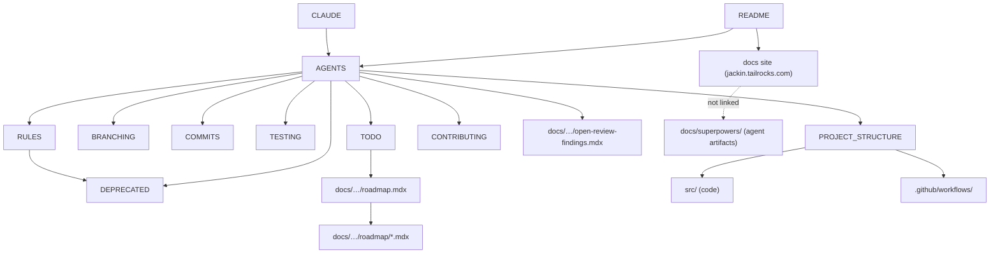
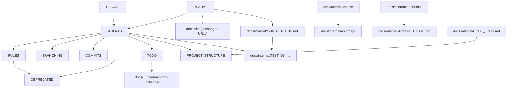

# Readability & Modernization Roadmap

## §0 — Meta

**Last updated:** 2026-04-26
**Iteration:** 8

This is an analysis-only roadmap. Nothing in the codebase has been changed by the loop that produced this file. Every claim here is grounded in direct reading of the repository as it exists on the `analysis/readability-roadmap` branch (derived from `main` with PR #171 `feature/workspace-manager-tui-secrets` treated as already merged per operator instruction). Recommendations are inputs to a future, separate execution effort — no code has been touched.

Revision history: [`_iteration_log.md`](./_iteration_log.md).
Research sources: [`_research_notes.md`](./_research_notes.md).

**Stack constraints (immovable):**
- Application code: Rust only.
- Docs site: TypeScript strict mode + Astro Starlight only. No migration to other frameworks.
- "Strict TS" means: `tsconfig.json` extends `astro/tsconfigs/strict`; must add `noUncheckedIndexedAccess` and `exactOptionalPropertyTypes` — see §7 Astro Starlight.
- Everything else (crate selection, tooling, CI structure, AI workflow) is open and is researched and recommended in this document.

---

## §1 — Project Inventory

### File-tree snapshot

Derived from direct reading; excludes `target/`, `node_modules/`, `.git/`.

```
jackin/
├── src/                      Rust CLI binary — 72 .rs files, ~40,664 lines
│   ├── main.rs               Entry point — constructs Cli, calls run()
│   ├── lib.rs                Thin crate root (~20 LOC), module decls, pub use
│   ├── app/                  Command dispatch and console context helpers
│   │   ├── mod.rs            run() dispatch match (951 lines — god function)
│   │   └── context.rs        Target classification, workspace resolution (800 lines)
│   ├── cli/                  Clap schema, split by topic
│   ├── config/               TOML config model + persistence + in-memory editor
│   │   ├── mod.rs            AppConfig struct + all config types (867 lines)
│   │   └── editor.rs         Full TOML editing engine — toml_edit-based (1467 lines)
│   ├── workspace/            Workspace model, mount parsing, path resolution
│   ├── manifest/             Agent manifest schema + validator
│   ├── runtime/              Container lifecycle
│   │   └── launch.rs         Container bootstrap pipeline (2368 lines — largest file)
│   ├── console/              Interactive operator-console TUI
│   │   ├── manager/          Workspace-manager TUI subsystem (16 files, many large)
│   │   └── widgets/          Reusable TUI widgets (incl. op_picker/ after PR #171)
│   ├── instance/             Per-container state preparation
│   ├── tui/                  General terminal UI helpers
│   ├── operator_env.rs       Operator env resolution — op://, $VAR, literals (1569 lines)
│   ├── env_model.rs          Reserved env var policy, interpolation parsing
│   ├── env_resolver.rs       Runtime env resolution with interactive prompts (560 lines)
│   ├── selector.rs           Agent selector parsing
│   ├── docker.rs             Docker command builder, CommandRunner trait
│   ├── derived_image.rs      Dockerfile generation for agent images
│   ├── paths.rs              XDG-compliant data/config directory resolution
│   ├── repo.rs               Agent repo validation
│   ├── repo_contract.rs      Enforces construct base-image extension
│   ├── version_check.rs      Claude CLI version detection for cache-busting
│   ├── terminal_prompter.rs  Interactive env-var prompting
│   └── bin/
│       └── validate.rs       jackin-validate binary (manifest validator)
├── tests/                    Integration tests — 6 files, ~3,124 lines
│   ├── workspace_config_crud.rs  456 lines — workspace CRUD via ConfigEditor
│   ├── workspace_mount_collapse.rs  314 lines
│   ├── cli_env.rs            268 lines
│   ├── manager_flow.rs       (not measured — unlisted by wc -l in pass)
│   ├── install_plugins_bootstrap.rs  191 lines
│   └── validate_cli.rs       152 lines
├── docs/
│   ├── src/content/docs/     Astro Starlight content — 47 pages
│   ├── superpowers/          Agent workflow artifacts — NOT shipped to public site
│   │   ├── plans/            5 implementation plans (2026-04-22/23 dates)
│   │   ├── specs/            6 design specs (2026-04-22/23 dates)
│   │   └── reviews/          PR #171 code review docs (PR #171 branch only)
│   └── astro.config.ts       Starlight config — sidebar, social, edit links
├── docker/
│   └── construct/            Shared base image — Dockerfile, install-plugins.sh, zshrc
├── .github/
│   └── workflows/            6 workflows: ci.yml, construct.yml, docs.yml,
│                               preview.yml, release.yml, renovate.yml
├── Cargo.toml                Crate manifest — deps + [lints] table
├── Justfile                  Docker construct image build recipes (not general dev)
├── build.rs                  Git SHA embedding into JACKIN_VERSION env var
├── docker-bake.hcl           Multi-platform Docker Bake build graph
├── mise.toml                 Tool versions: bun 1.3.13, just 1.50.0, node 24.15.0, rust 1.95.0
├── release.toml              cargo-release config
├── renovate.json             Renovate dependency update config
├── README.md                 Public overview + install instructions (83 lines)
├── AGENTS.md                 AI agent rules — PR merging, attribution, code review scope
├── CLAUDE.md                 1 line: "@AGENTS.md"
├── RULES.md                  Doc convention + deprecation rule (+ TUI Keybindings, TUI List Modals after PR #171)
├── BRANCHING.md              Branch naming and PR policy
├── COMMITS.md                Conventional Commits, DCO, agent attribution trailers
├── TESTING.md                cargo-nextest commands + pre-commit requirements
├── TODO.md                   Follow-ups (external deps, internal cleanups) + stale-docs checklist
├── DEPRECATED.md             Active deprecations ledger
├── CONTRIBUTING.md           Contribution flow, DCO text, license terms
├── PROJECT_STRUCTURE.md      Large navigation reference (AI-agent and contributor map)
├── CHANGELOG.md              Keep-a-changelog format, Unreleased section
├── LICENSE                   Apache-2.0
└── NOTICE                    Attribution notice
```

**Note:** `PROJECT_REVIEW.md`, `RUST_REVIEW_FINDINGS.md`, `SECURITY_REVIEW_FINDINGS.md`, `SECURITY_EXCEPTIONS.md` are NOT present in the repository. Security exceptions are tracked in the public docs at `docs/src/content/docs/reference/roadmap/open-review-findings.mdx`. PR #171 adds a `docs/superpowers/reviews/` subtree to the branch; it is not yet on main at time of this analysis.

### Module map of `src/`

| File / Module | Lines | Public items (condensed) | Primary responsibility | Key imports |
|---|---|---|---|---|
| `main.rs` | ~15 | — | entry point | `app::run` |
| `lib.rs` | ~20 | `run` | module decls + re-export | all modules |
| `app/mod.rs` | 951 | `run()` | Command dispatch (giant match) | nearly every module |
| `app/context.rs` | 800 | `TargetKind`, `classify_target`, `resolve_agent_from_context`, `remember_last_agent` | workspace/agent context resolution | `config`, `workspace`, `selector` |
| `cli/mod.rs` | ~80 | `Cli`, `Command` | root clap schema | cli/* |
| `cli/agent.rs` | — | `LoadArgs`, `ConsoleArgs`, `HardlineArgs` | load/console/hardline args | clap |
| `cli/cleanup.rs` | — | `EjectArgs`, `PurgeArgs` | eject/purge args | clap |
| `cli/config.rs` | — | `ConfigCommand` enum | config subcommand args | clap |
| `cli/workspace.rs` | — | `WorkspaceCommand` | workspace subcommand args | clap |
| `cli/dispatch.rs` | — | `classify`, `is_tui_capable` | bare-jackin dispatch routing | — |
| `config/mod.rs` | 867 | `AppConfig`, `AuthForwardMode`, `ClaudeConfig`, `AgentSource`, `DockerConfig` | config types + `require_workspace` | workspace, editor, mounts |
| `config/editor.rs` | 1467 | `ConfigEditor`, `EnvScope` | full TOML editing engine | `toml_edit` |
| `config/agents.rs` | — | `BUILTIN_AGENTS` const | builtin agent list | — |
| `config/mounts.rs` | — | `DockerMounts`, `MountEntry` | global mount registry | — |
| `config/persist.rs` | — | load/save helpers | config file I/O | `toml`, `toml_edit` |
| `config/workspaces.rs` | — | workspace CRUD on AppConfig | workspace write operations | — |
| `workspace/mod.rs` | ~60 | `MountConfig` + re-exports | re-export hub | workspace/* |
| `workspace/planner.rs` | 718 | `WorkspaceCreatePlan`, `WorkspaceEditPlan`, `CollapsePlan`, `plan_create`, `plan_edit`, `plan_collapse` | workspace mutation planning | workspace/* |
| `workspace/resolve.rs` | 503 | `LoadWorkspaceInput`, `ResolvedWorkspace`, `resolve_load_workspace` | workspace resolution at launch | config, workspace/* |
| `workspace/mounts.rs` | — | mount parse/validate functions | mount spec parsing + validation | — |
| `workspace/paths.rs` | — | `expand_tilde`, `resolve_path` | path utilities | — |
| `workspace/sensitive.rs` | — | `SensitiveMount`, `find_sensitive_mounts`, `confirm_sensitive_mounts` | sensitive-path detection | — |
| `manifest/mod.rs` | 522 | `AgentManifest`, `load`, `display_name` | manifest schema + loader | serde, toml |
| `manifest/validate.rs` | 962 | `validate`, `is_valid_env_var_name` | manifest validation rules | env_model, manifest/mod |
| `runtime/mod.rs` | ~20 | thin re-exports only | re-export hub | runtime/* |
| `runtime/launch.rs` | 2368 | `LoadOptions`, `load_agent` | full container bootstrap pipeline | config, instance, paths, selector, tui, naming, image, identity, attach, cleanup, repo_cache, operator_env |
| `runtime/attach.rs` | — | `hardline_agent`, `inspect_container_state`, `wait_for_dind` | container attach / hardline / DinD readiness | docker |
| `runtime/cleanup.rs` | 587 | `gc_orphaned_resources`, `run_cleanup_command` | eject, purge, orphan GC | docker, runtime/naming |
| `runtime/image.rs` | — | `build_agent_image` | Docker image build | docker, derived_image |
| `runtime/naming.rs` | — | label constants, `image_name`, `format_agent_display`, `dind_certs_volume` | Docker label/name conventions | — |
| `runtime/identity.rs` | — | `GitIdentity`, `load_git_identity`, `load_host_identity` | git/host identity for containers | — |
| `runtime/repo_cache.rs` | 559 | `resolve_agent_repo` | agent repo lock + fetch | — |
| `runtime/discovery.rs` | — | `list_managed_agent_names`, `list_running_agent_display_names` | list managed containers | docker |
| `console/mod.rs` | ~200 | `run_console` | TUI entry point + event loop | ratatui, crossterm, console/* |
| `console/state.rs` | 485 | `ConsoleStage`, `ConsoleState`, `WorkspaceChoice` | top-level console state | config, workspace |
| `console/input.rs` | ~180 | `handle_event`, `EventOutcome` | console stage event routing | console/state |
| `console/preview.rs` | — | `resolve_selected_workspace` | workspace preview detail lines | — |
| `console/render.rs` | — | `draw_agent_screen` | agent-picker screen rendering | ratatui |
| `console/manager/mod.rs` | — | `ManagerState`, `render` | workspace manager entry points | manager/* |
| `console/manager/state.rs` | 865 | `EditorState`, `ManagerState`, `Modal`, `change_count` | manager + editor state + Modal enum | workspace, config |
| `console/manager/input/mod.rs` | — | `handle_key` | input dispatch hub for manager | manager/input/* |
| `console/manager/input/editor.rs` | 1304 | — | editor tab key bindings | manager/* |
| `console/manager/input/list.rs` | 614 | `handle_list_modal` | list view + list modal dispatch | manager/state |
| `console/manager/input/save.rs` | 1418 | `build_confirm_save_lines` | ConfirmSave modal dispatch + rendering helpers | manager/* |
| `console/manager/input/prelude.rs` | 533 | — | workspace-create wizard input | manager/* |
| `console/manager/input/mouse.rs` | 689 | — | mouse event handling for manager | manager/* |
| `console/manager/render/mod.rs` | — | `render` | render dispatch for manager stages | manager/render/* |
| `console/manager/render/list.rs` | 1122 | — | list view drawing | ratatui |
| `console/manager/render/editor.rs` | 782 | — | editor tabs drawing | ratatui |
| `console/manager/render/modal.rs` | — | — | modal overlay rendering | ratatui |
| `console/manager/mount_info.rs` | 745 | — | mount-info formatting for TUI rows | workspace |
| `console/manager/create.rs` | — | — | create-workspace wizard state machine | manager/* |
| `console/manager/agent_allow.rs` | — | — | allowed-agents tab logic | — |
| `console/manager/github_mounts.rs` | — | — | GitHub mount listing for picker | — |
| `console/widgets/mod.rs` | — | re-exports | widget re-export hub | widgets/* |
| `console/widgets/text_input.rs` | — | `TextInputState`, `TextInputTarget` | single-line text input modal | ratatui |
| `console/widgets/file_browser/` | ~1700 total | `FileBrowserState` | file browser modal | ratatui |
| `console/widgets/confirm.rs` | — | `ConfirmState`, `ConfirmTarget` | Y/N confirm modal | ratatui |
| `console/widgets/confirm_save.rs` | — | `ConfirmSaveState` | save-confirm preview modal | ratatui |
| `console/widgets/github_picker.rs` | — | `GithubPickerState` | GitHub URL picker | ratatui |
| `console/widgets/op_picker/` | — | `OpPickerState` (after PR #171) | 1Password vault browser modal | operator_env::OpStructRunner |
| `console/widgets/workdir_pick.rs` | — | `WorkdirPickState` | workdir-from-mounts picker | ratatui |
| `console/widgets/mount_dst_choice.rs` | — | — | mount destination picker | ratatui |
| `console/widgets/error_popup.rs` | — | — | error overlay | ratatui |
| `console/widgets/save_discard.rs` | — | `SaveDiscardState` | save/discard/cancel modal | ratatui |
| `console/widgets/panel_rain.rs` | — | — | digital-rain panel effect | ratatui |
| `instance/mod.rs` | — | `AgentState` | per-container state orchestration | instance/* |
| `instance/auth.rs` | 796 | — | auth-forward modes, credential handling, symlink safety | — |
| `instance/naming.rs` | — | `primary_container_name` | container slug + clone naming | — |
| `instance/plugins.rs` | — | — | plugin marketplace serialisation | serde |
| `operator_env.rs` | 1569 | `OpRunner`, `dispatch_value`, `OpCli`, `EnvLayer`, `merge_layers`, `validate_reserved_names`, `resolve_operator_env`, `resolve_operator_env_with`, `print_launch_diagnostic`, `OpStructRunner` (PR #171), `OpAccount/Vault/Item/Field` (PR #171) | all operator env resolution | — |
| `env_model.rs` | — | `is_reserved`, `extract_interpolation_refs`, `topological_env_order` | reserved env policy | — |
| `env_resolver.rs` | 560 | `resolve_env` | runtime env resolution + interactive prompts | operator_env, terminal_prompter |
| `tui/mod.rs` | — | `DEBUG_MODE`, palette constants, `set_terminal_title`, `step_shimmer`, `step_quiet`, `set_debug_mode` | shared TUI palette + step helpers | owo-colors, crossterm |
| `tui/animation.rs` | 582 | `digital_rain`, `run_intro`, `run_outro` | intro/outro animation | ratatui, crossterm |
| `tui/output.rs` | — | `tables`, `hints`, `fatal`, `logo`, `title` | non-TUI terminal output helpers | tabled, owo-colors |
| `tui/prompt.rs` | — | `prompt_choice`, `spin_wait`, `require_interactive_stdin` | interactive prompts + spinner | dialoguer |
| `selector.rs` | — | `ClassSelector`, `Selector` | agent selector parsing | — |
| `docker.rs` | — | `CommandRunner` trait, `ShellRunner`, `RunOptions` | Docker command builder | std::process |
| `derived_image.rs` | — | (Dockerfile gen for agent images) | derive Dockerfile from base | dockerfile-parser-rs |
| `paths.rs` | — | `JackinPaths` | XDG config/data directory resolution | directories |
| `repo.rs` | — | — | agent repo structure validation | — |
| `repo_contract.rs` | — | — | enforce construct base-image use | — |
| `version_check.rs` | — | — | Claude CLI version detection | std::process |
| `terminal_prompter.rs` | — | — | manifest-level env-var prompting | dialoguer |
| `bin/validate.rs` | — | — | jackin-validate binary entry | manifest/* |

### Markdown landscape

| File | Audience | Purpose | Notable overlaps | Last-edit signal |
|---|---|---|---|---|
| `README.md` (83L) | Public / new users | Install + quick start + ecosystem links | Links to docs site | PR #166 era |
| `AGENTS.md` | AI agents (all tools) | PR merging rules, commit attribution, code-review scope, shared convention links | Links to RULES/BRANCHING/COMMITS/TESTING/PROJECT_STRUCTURE/DEPRECATED/TODO/CONTRIBUTING | Core stable; minor additions each PR |
| `CLAUDE.md` (1L) | Claude Code tool | One-line pointer to AGENTS.md | — | Stable |
| `RULES.md` | AI agents + contributors | Doc convention + deprecation rule (+ TUI Keybindings + TUI List Modals in PR #171) | Deprecation rule duplicates DEPRECATED.md entry format | Updated PR #171 |
| `BRANCHING.md` | All contributors | Branch naming + PR policy | Some overlap with COMMITS.md preamble | Stable |
| `COMMITS.md` | All contributors | Conventional Commits, DCO sign-off, agent attribution | Agent attribution also in AGENTS.md | Stable |
| `TESTING.md` | All contributors | nextest commands + pre-commit | Pre-commit requirements also in COMMITS.md | Stable |
| `TODO.md` | Operator (periodic review) | External dep tracking + stale-docs checklist + roadmap pointer | Roadmap pointer is the single authoritative redirect | Updated per PR |
| `DEPRECATED.md` | AI agents + contributors | Active deprecations ledger | — | PR #166 |
| `CONTRIBUTING.md` | External contributors | Contribution flow, DCO text, license | DCO text duplicated in COMMITS.md sign-off section | Stable |
| `PROJECT_STRUCTURE.md` | AI agents + contributors | Navigational map of every directory and file | Needs update when modules change (stale risk) | PR #166 era |
| `CHANGELOG.md` | Public / release consumers | Version history, keep-a-changelog | — | Updated each release |
| `LICENSE` | Public | Apache-2.0 | — | Immutable |
| `NOTICE` | Public | Attribution | — | Stable |

### Hot-spot list

Files with >500 lines (verified counts). **Production LOC** is the critical metric — files large due to test suites are less urgent to split than files with large production logic. Test section start confirmed by `grep -n "#\[cfg(test)\]"` for each file (iteration 6).

| File | Total | Prod LOC | Test LOC | Suppressions | Priority |
|---|---|---|---|---|---|
| `src/runtime/launch.rs` | 2368 | **1085** | 1282 | 3× `too_many_lines` | **Highest** — production code is genuinely large |
| `src/app/mod.rs` | 951 | **928** | 22 | 1× `too_many_lines` | **High** — nearly all production; 928L dispatch function |
| `src/operator_env.rs` | 1569 | **810** | 758 | 0 | **High** — production and tests roughly equal |
| `src/console/manager/state.rs` | 865 | **577** | 287 | 0 | **Medium** — Modal enum + EditorState logic |
| `src/console/manager/input/save.rs` | 1418 | **567** | 850 | 2× `too_many_lines` | **Medium** — ConfirmSave pipeline |
| `src/console/manager/input/editor.rs` | 1304 | **547** | 756 | 3× `too_many_lines` | **Medium** — editor key bindings |
| `src/app/context.rs` | 800 | **347** | 452 | 0 | Low — tests dominate |
| `src/console/manager/render/editor.rs` | 782 | ~782 (no test section found) | ~0 | 0 | **Medium** — all production (render functions, no tests) |
| `src/workspace/planner.rs` | 718 | **235** | 482 | 0 | Low — tests dominate |
| `src/console/manager/input/mouse.rs` | 689 | **206** | 482 | 0 | Low — tests dominate |
| `src/console/manager/render/list.rs` | 1122 | **404** | 718 | 0 | Low-medium — multiple interspersed test blocks |
| `src/config/editor.rs` | 1467 | **503** | 963 | 0 | Medium — production reasonable; tests dominate |
| `src/tui/animation.rs` | 582 | ~582 (no test section found) | ~0 | 1× `too_many_lines` | Medium — all production (animation logic) |
| `src/runtime/cleanup.rs` | 587 | **220** | 366 | 0 | Low |
| `src/runtime/repo_cache.rs` | 559 | **213** | 345 | 0 | Low |
| `src/env_resolver.rs` | 560 | **137** | 422 | 0 | Low — tests dominate; production is small |
| `src/console/manager/input/prelude.rs` | 533 | **284** | 248 | 1× `too_many_lines` | Low-medium |
| `src/manifest/mod.rs` | 522 | **86** | 435 | 0 | Low — tiny production, well-tested |
| `src/workspace/resolve.rs` | 503 | **170** | 332 | 0 | Low |
| `src/manifest/validate.rs` | 962 | **145** | 816 | 0 | **Low** — 145L production, 816L tests; exemplary test discipline |
| `src/config/mod.rs` | 867 | **134** | 732 | 0 | **Low** — 134L production; tests are comprehensive |
| `src/instance/auth.rs` | 796 | **210** | 585 | 0 | **Low** — resolved OQ5; not a god file |

**Key insight from iteration 6 analysis:** Total line count is a misleading hot-spot metric. `manifest/validate.rs` (962L) and `config/mod.rs` (867L) appear in the top 10 by total LOC but have only 145L and 134L of production code respectively — both are exemplars of thorough testing, not god files. The true god files by production LOC are `runtime/launch.rs` (1085L), `app/mod.rs` (928L), and `operator_env.rs` (810L).

Total `#[allow(clippy::too_many_lines)]` suppressions: **13** across 8 files.

`mod.rs` files containing real logic (not just re-exports):
- `src/app/mod.rs` (951L) — the entire `run()` dispatch function lives here.
- `src/config/mod.rs` (867L) — all `AppConfig`, `AuthForwardMode`, `ClaudeConfig` structs are defined here, not in sub-files.
- `src/manifest/mod.rs` (522L) — schema structs, `load()`, `display_name()` all here.
- `src/console/mod.rs` (~200L) — `run_console()` entry point and TUI event loop.
- `src/tui/mod.rs` — palette constants and `DEBUG_MODE` flag live here alongside `set_terminal_title`.

Modules with ≥10 sibling files:
- `src/console/manager/` — 16 files across 3 subdirs (`input/`, `render/`, flat files).
- `src/console/widgets/` — 11+ files after PR #171 (adds `op_picker/`, `agent_picker.rs`, `scope_picker.rs`, `source_picker.rs`).

**Rustdoc `//!` coverage (exact count, iteration 4):** Of **90 `.rs` files** (72 on main + ~18 added by PR #171), **37 have `//!` module orientation docs** (41%). Coverage is strongly clustered: `src/console/manager/` and `src/console/widgets/` are the best-covered subsystems — PR #171 additions were written with docs discipline. The 53 files without `//!` docs are concentrated in the older codebase: all of `src/app/` (both files), all of `src/cli/` (5 files), all of `src/instance/` (4 files), most of `src/runtime/` (8 of 10), and all root-level helpers (`derived_image.rs`, `docker.rs`, `env_resolver.rs`, `paths.rs`, `repo.rs`, `repo_contract.rs`, `selector.rs`, `version_check.rs`, `terminal_prompter.rs`, `main.rs`, `lib.rs`, `bin/validate.rs`). The `src/console/manager/` family is the best-documented subsystem by ratio; `src/runtime/` is the worst. No `#![warn(missing_docs)]` gate is set anywhere in `Cargo.toml` or `src/lib.rs`.

### Astro / Starlight content inventory

- Content collection: `docs/src/content/docs/` — loaded via `docsLoader()` in `content.config.ts`.
- Page count: **47 pages** (per operator note; matches sidebar in `astro.config.ts`).
- Slug groups: `getting-started/`, `guides/`, `commands/`, `developing/`, `reference/`, `reference/roadmap/`.
- Public site URL: https://jackin.tailrocks.com/
- TypeScript strictness: `docs/tsconfig.json` extends `"astro/tsconfigs/strict"`. However, this preset does NOT enable `noUncheckedIndexedAccess` or `exactOptionalPropertyTypes` by default — these must be added explicitly to satisfy the stack constraint (see §7 Astro Starlight).
- `docs/superpowers/` subtree: lives outside `docs/src/content/docs/` and is NOT part of the Astro content collection — **does not ship to the public site**. Contains `plans/`, `specs/`, and (in PR #171 branch) `reviews/`.
- Custom components: `docs/src/components/overrides/` (Starlight overrides) and `docs/src/components/landing/` (React islands). TypeScript strictness state of these components needs per-iteration verification.

---

## §2 — Concept-to-Location Index

For each concept: current location, findability rating, proposed location, estimated post-refactor rating.

Ratings: `obvious` = visible from README or 1 click; `discoverable-in-2-hops` = MODULE_STRUCTURE or grep for a clear name; `requires-grep` = needs grep/rg; `requires-tribal-knowledge` = no obvious search path.

Post-refactor target: **zero** entries rated `requires-grep` or `requires-tribal-knowledge`.

| # | Concept | Current location | Rating today | Proposed location | Post-refactor rating |
|---|---|---|---|---|---|
| 1 | **`AgentPicker` modal** | `src/console/manager/state.rs:245` (Modal enum, `AgentPicker` variant, after PR #171); `src/console/widgets/agent_picker.rs` (state) | `requires-grep` — `Modal` enum is in state.rs, widget is flat at widgets root | `src/console/widgets/agent_picker/` — self-contained subdirectory with `mod.rs`, `state.rs`, `render.rs`; Modal enum documents where each variant's state type lives | `discoverable-in-2-hops` |
| 2 | **`OpPicker` state machine** | `src/console/widgets/op_picker/mod.rs` + `render.rs` (after PR #171) | `requires-grep` — no entry in PROJECT_STRUCTURE.md yet | Entry in PROJECT_STRUCTURE.md; canonical layout rule in `RULES.md § TUI List Modals` already added in PR #171 | `discoverable-in-2-hops` |
| 3 | **Workspace env diff (`change_count`)** | `src/console/manager/state.rs:517` — `EditorState::change_count()` method | `requires-grep` | Same file is fine; add `//!` to state.rs explaining it is the editor-state source of truth | `discoverable-in-2-hops` |
| 4 | **Console event-loop polling (20 Hz / 50ms)** | PR #171 branch `src/console/mod.rs:90` — `const TICK_MS: u64 = 50;` with doc comment "20 Hz: spinner stays fluid and op results surface within ~50ms without hot-spinning. <16ms wastes cycles, >100ms stutters."; `ms.poll_picker_loads()` is called at line ~200 before each render to drain worker results; the non-blocking `event::poll(Duration::from_millis(TICK_MS))` at line ~217 replaces the main branch's blocking `event::read()`. The `is_on_main_screen` and `consumes_letter_input` helpers at lines ~111–130 gate the `Q` exit-confirmation flow introduced in the same PR. | `requires-tribal-knowledge` on main (no TICK_MS, no poll rationale); `discoverable-in-2-hops` once PR #171 merges (TICK_MS is named and documented inline) | Add `//!` to `console/mod.rs` summarising the 20 Hz loop contract; the constant and its doc comment already do the job once PR #171 merges — no structural change needed | `discoverable-in-2-hops` |
| 5 | **`OpStructRunner` trait and threading contract** | `src/operator_env.rs:348` (after PR #171); doc comment "Distinct from OpRunner: picker is a metadata browser and must never deserialize a secret value" | `requires-grep` — nothing in PROJECT_STRUCTURE.md points here yet | Update PROJECT_STRUCTURE.md §operator_env; the threading contract belongs in a `//!` module doc or in a separate `src/op/` module if operator_env splits | `discoverable-in-2-hops` |
| 6 | **`RawOpField` no-`value`-key trust invariant + compile-time safety test** | PR #171 branch `src/operator_env.rs:446` — `RawOpField` serde struct has no `value` field by design (serde silently drops any `value` key from `op item get` JSON). The compile-time guarantee is enforced by a regular `#[test]` at line ~2055 (`op_struct_runner_item_get_parses_fields_no_value`) that uses an **exhaustive struct destructure** pattern: `let OpField { id: _, label: _, field_type: _, concealed: _, reference: _ } = fields[1].clone();` — if anyone adds a `value` field to `OpField`, Rust's exhaustive match fails to compile before the test even runs. The comment explicitly states: "Compile-time guarantee: OpField has no `value` field. If a future refactor adds one, this struct-match will fail to compile and force an explicit re-review of the trust model." | `requires-tribal-knowledge` — the technique is not a trybuild compile-fail test (which reviewers would search for), it's an exhaustive destructure inside a runtime test | Add a `//!` section to `operator_env.rs` titled "Trust invariant: no secret values in the picker path" explaining the `RawOpField` design and pointing to the compile-time enforcement test | `discoverable-in-2-hops` |
| 7 | **`RULES.md § TUI Keybindings`** | `RULES.md` lines added by commit `9cf8f5e` in PR #171 | `obvious` — root-level file, AGENTS.md links to RULES.md | No change needed once PR #171 merges | `obvious` |
| 8 | **Agent → Docker image resolution path for `jackin load`** | `src/app/mod.rs:55`–`~130` (Command::Load arm) → `src/workspace/resolve.rs:65` (`resolve_load_workspace`) → `src/runtime/launch.rs:533` (`load_agent`) → `src/runtime/image.rs` (`build_agent_image`) | `requires-grep` — 4-hop chain across modules | `docs/internal/CODE_TOUR.md` — a call-chain walkthrough; PROJECT_STRUCTURE.md already documents each hop but doesn't trace the sequence | `discoverable-in-2-hops` |
| 9 | **`hardline` command implementation** | `src/app/mod.rs:147` dispatches to `src/runtime/attach.rs:78` (`hardline_agent`) | `discoverable-in-2-hops` — PROJECT_STRUCTURE.md documents `runtime/attach.rs` and its `hardline_agent` function | Stable; no move needed | `discoverable-in-2-hops` |
| 10 | **`construct` base image build invocation** | `Justfile` recipes `construct-build-local`, `construct-push-platform`, `construct-publish-manifest`; `docker-bake.hcl` targets `construct-local` and `construct-publish` | `requires-grep` — Justfile not linked from AGENTS.md | Add Justfile → CI workflow mapping to PROJECT_STRUCTURE.md §CI; Justfile top-comment currently explains only Docker construct, which is correct | `discoverable-in-2-hops` |
| 11 | **Release automation flow** | `release.toml` (cargo-release config) + `.github/workflows/release.yml` + `CHANGELOG.md` next-header convention | `requires-grep` for first-timers | `docs/internal/CONTRIBUTING.md` (§ Cutting a release) | `discoverable-in-2-hops` |
| 12 | **Candidate-config validation-before-rename invariant** | `src/config/editor.rs` — commit `f4487fa` in PR #171 adds pre-rename validation; the invariant is: validate the candidate WorkspaceConfig before applying a name change, so rename + invalid-config doesn't partially commit | `requires-tribal-knowledge` — only visible from PR #171 commit message | Add a named test (`fn rename_validates_candidate_before_applying`) with a doc comment explaining the invariant; once PR #171 merges this is at `src/config/editor.rs` | `discoverable-in-2-hops` |
| 13 | **`op://` reference parsing (3-segment vs 4-segment)** | `src/operator_env.rs` — `dispatch_value` handles `op://` prefix; PR #171 commit `05c1866` adds 4-segment `vault/item/section/field` parsing in `OpCli::item_get` | `requires-grep` | The 4-segment rule belongs in a `//!` comment at the top of `operator_env.rs` and/or in `docs/src/content/docs/developing/agent-manifest.mdx` | `discoverable-in-2-hops` |
| 14 | **Session-scoped op metadata cache** | PR #171 branch `src/console/op_cache.rs` (252L, verified iteration 6) — standalone module `OpCache` with `//!` module doc stating "Session-scoped cache for `op` structural-metadata calls. Stores only structural metadata (UUIDs, names, labels, types). Field values are never read." Keyed by `(account, vault_id, item_id)` tuples; `OpPickerState` holds a reference to the cache; the `OpCache` is separate from `OpPickerState` to allow sharing across picker reopens within a session. Invalidation methods: `invalidate_accounts()`, `invalidate_vaults()`. A `DEFAULT_ACCOUNT_KEY = ""` sentinel avoids `Option<String>` in BTreeMap keys. | `requires-tribal-knowledge` (pre-merge) — `op_cache.rs` is a new module not yet in PROJECT_STRUCTURE.md | After merge: add `src/console/op_cache.rs` entry to PROJECT_STRUCTURE.md with a one-line description of the trust invariant (metadata only, never field values) | `discoverable-in-2-hops` |
| 15 | **Caps-lock SHIFT-modifier tolerance pattern** | `src/console/manager/input/editor.rs:1034` ("Operators often hit `d` without holding shift; the binding...") and `:1177` (same for `r`); `src/console/mod.rs:75` comment about Shift/Option for text selection bypass | `requires-grep` — scattered across three files | `RULES.md § TUI Keybindings` (already documents modifier-free approach) + inline comments are sufficient; no structural change needed | `discoverable-in-2-hops` once RULES.md updated |
| 16 | **`Q` exit-confirmation gating** | Two layers: (1) main branch `src/console/manager/input/list.rs:26` — bare `q\|Q` exits from the list view; (2) PR #171 `src/console/mod.rs:111–130` adds `is_on_main_screen` and `consumes_letter_input` helper functions that gate whether `Q` exits silently (when on the main list with no modal) or opens a confirmation dialog (`state.quit_confirm`). The PR also adds a `quit_confirm_area()` layout helper at line ~92. The design intent: `Q` on the main screen is a "safe" exit because no unsaved work is possible; `Q` anywhere else (editor, picker) opens a confirm modal because unsaved changes may exist. | `requires-grep` — the two-layer design (main branch list.rs + PR #171 console/mod.rs) is not obvious from reading either file alone | Add `//!` to `console/mod.rs` explaining the `Q` routing contract; reference `is_on_main_screen` and `consumes_letter_input` | `discoverable-in-2-hops` |
| 17 | **Workspace list refresh after manager save (b3c6998)** | PR #171 fix commit — after save, the console list state is rebuilt from config so the launch routing sees the updated workspace | `requires-tribal-knowledge` pre-merge | After merge: the fix is in the save path in `console/manager/input/save.rs`; a doc comment on the save function explaining "list state is rebuilt from config post-save" is sufficient | `discoverable-in-2-hops` |
| 18 | **Auth-forward modes and credential provisioning** | `AuthForwardMode` defined at `src/config/mod.rs:26`; `AgentState::provision_claude_auth` (the dispatch that acts on the mode) at `src/instance/auth.rs:17` | `requires-grep` — the mode definition and the behavior that uses it are in different modules | `AuthForwardMode` is **correctly placed** in `config/mod.rs` — verified iteration 8: it appears as a config field in `ClaudeConfig:89` and `ClaudeAgentConfig:96`, has serde `Deserialize` at line 74, and is used in 9 files (`config/`, `instance/`, `app/`, `runtime/`). Moving it to `instance/auth.rs` would be wrong: `config` would then import from `instance`, creating a circular dependency. The proposed move in §10 step 4a (to `config/types.rs`) is correct — it stays within the `config` module, just in a sub-file. The navigation gap is addressed by the §10 step 4a type extraction. | `discoverable-in-2-hops` post-§10-4a |
| 19 | **Workspace mount planning (plan_collapse)** | `src/workspace/planner.rs:195` — `plan_collapse` function | `discoverable-in-2-hops` — PROJECT_STRUCTURE.md names the file | Stable | `discoverable-in-2-hops` |
| 20 | **`XDG` config/data path resolution** | `src/paths.rs` — `JackinPaths::detect()` | `obvious` — PROJECT_STRUCTURE.md documents `paths.rs` | Stable | `obvious` |
| 21 | **Docker command builder / test seam** | `src/docker.rs` — `CommandRunner` trait + `ShellRunner`; `FakeRunner` in `runtime/test_support.rs` | `discoverable-in-2-hops` | Stable; `FakeRunner` location noted in PROJECT_STRUCTURE.md | `discoverable-in-2-hops` |
| 22 | **Agent manifest schema** | `src/manifest/mod.rs` (522L) — `AgentManifest` struct and sub-structs | `discoverable-in-2-hops` — PROJECT_STRUCTURE.md documents this | Split `AgentManifest` structs from `load()` function: `src/manifest/schema.rs` (types) + `src/manifest/loader.rs` (I/O) | `obvious` |
| 23 | **Topological env-var ordering (cycle detection)** | `src/env_model.rs` — `topological_env_order` function; file has a full `//!` module doc | `obvious` — `//!` doc is exemplary; PROJECT_STRUCTURE.md documents the file | No change needed; model for other files | `obvious` |
| 24 | **Lint and clippy configuration** | `Cargo.toml` `[lints.clippy]` section — pedantic + nursery as warn, correctness + suspicious as deny, cast truncation allowed for TUI | `discoverable-in-2-hops` — `Cargo.toml` is top-level | No structural change; document rationale inline in Cargo.toml comments or a `docs/internal/decisions/` ADR | `discoverable-in-2-hops` |
| 25 | **Toolchain version pinning** | `mise.toml` (rust = "1.95.0") + `Cargo.toml` rust-version = "1.94" + CI workflows (dtolnay/rust-toolchain SHA `e08181...` = 1.95.0) | `requires-tribal-knowledge` — three different files express the version; the 1.94/1.95 discrepancy is subtle | Add a `rust-toolchain.toml` pointing at 1.95.0 as the canonical source; `mise.toml` and CI steps read from it (or document why they don't) | `discoverable-in-2-hops` |

---

## §3 — Documentation Hierarchy Diagnosis & Proposal

### Current state

The repository has two overlapping doc hierarchies that serve different audiences but live in the same flat space at the root:

1. **Root markdown files** (12 `.md` / `.toml` files at repo root): Mix of public-facing (`README.md`, `CHANGELOG.md`), agent-facing (`AGENTS.md`, `CLAUDE.md`, `RULES.md`, `COMMITS.md`, `BRANCHING.md`, `TESTING.md`), and contributor-facing (`CONTRIBUTING.md`, `DEPRECATED.md`, `PROJECT_STRUCTURE.md`, `TODO.md`). All flat at the root.

2. **Docs site** (`docs/src/content/docs/`): 47 pages, publicly deployed at https://jackin.tailrocks.com/. User-facing. No overlap with root markdown files in content, but `CONTRIBUTING.md` and `TESTING.md` duplicate information that a contributor might reasonably expect to find at `docs/`.

3. **`docs/superpowers/`**: Agent workflow artifacts (plans, specs, reviews). Not public. Not in Starlight content collection. Lives in `docs/` by accident of superpowers tooling convention — it has no logical relationship to the public docs site.

### Diagnosis

- `PROJECT_STRUCTURE.md` (the largest root markdown at several hundred lines) is primarily an AI-agent navigation aid. It is not public documentation, not a user guide, and not a contributor guide. Its presence at root level makes it appear equally authoritative to README.md, which it is not.
- `CONTRIBUTING.md` and `TESTING.md` are contributor-facing but hidden at root level — contributors looking for contribution guidance often look in `docs/` or a `CONTRIBUTING.md` linked from README.md.
- `docs/superpowers/` is stranded: it belongs conceptually in `docs/internal/` but lives at `docs/superpowers/` because that is where the superpowers toolchain writes it.
- The files `PROJECT_REVIEW.md`, `RUST_REVIEW_FINDINGS.md`, `SECURITY_REVIEW_FINDINGS.md`, `SECURITY_EXCEPTIONS.md` mentioned in the loop prompt do NOT exist in the repository. Security exceptions are tracked in the public Starlight docs at `docs/src/content/docs/reference/roadmap/open-review-findings.mdx` per the `AGENTS.md` code-review instruction.
- `RULES.md` is growing: it started as two rules (doc convention + deprecation), and PR #171 adds two more (TUI Keybindings, TUI List Modals). As it grows it risks becoming a rules-dump without clear audience. Each rule section has a distinct audience (deprecation is contributor-facing; TUI Keybindings is agent-facing for UI work).
- There is no `docs/internal/` today. The operator's loop prompt targets `docs/internal/roadmap/` — this loop creates it.

### Target document shape

The proposed shape below addresses the problems above. URLs on the public docs site are invariants and must not change.

```
# Public-facing (root)
README.md           → install, overview, ecosystem, link to docs site
CHANGELOG.md        → version history (keep-a-changelog)
LICENSE, NOTICE     → legal

# Agent-facing (root — loaded in every AI agent session)
CLAUDE.md           → "@AGENTS.md" (1 line, stays terse)
AGENTS.md           → agent-only rules: PR merging, commit attribution, code review scope, shared convention links
RULES.md            → product invariants for AI agents: doc convention, deprecation rule, TUI rules; stays terse

# Contributor-facing (root — human contributor entry points)
BRANCHING.md        → branch naming + PR policy
COMMITS.md          → conventional commits + DCO + agent attribution
DEPRECATED.md       → active deprecations ledger

# Navigation / map (root — also agent-usable)
PROJECT_STRUCTURE.md → module/file map; candidate for migration to docs/internal/ in a future pass

# Internal contributor reference (does not ship to public site)
docs/internal/
  ARCHITECTURE.md             → ADR-style decisions that shaped the current structure; NOT duplicate of docs site reference/architecture.mdx
  CODE_TOUR.md                → walk-through of key call chains (load, console launch, hardline)
  CONTRIBUTING.md             → contribution flow, DCO, release process (currently at root)
  TESTING.md                  → test runner + pre-commit (currently at root)
  REVIEWS/                    → historical PR review docs; dated, indexed, never deleted
  decisions/                  → ADRs (NNN-title.md); see §7 ADRs
  roadmap/                    → this file + iteration log + research notes
  # (no specs/ dir — specs live in the public docs site as MDX; see §8.1)

# Public docs site (URLs invariant + new specs section)
docs/src/content/docs/        → 47 pages; Starlight build output
docs/src/content/docs/specs/  → living feature specs as Starlight MDX (draft: true while in-progress); see §8.1
```

**Files to move (future execution loop, not this one):**
- `CONTRIBUTING.md` → `docs/internal/CONTRIBUTING.md` + README.md link to new location
- `TESTING.md` → `docs/internal/TESTING.md` + AGENTS.md link to new location

**Files to leave in place (invariant or intentionally root-level):**
- `AGENTS.md`, `CLAUDE.md`, `RULES.md`, `BRANCHING.md`, `COMMITS.md`, `DEPRECATED.md`, `PROJECT_STRUCTURE.md` — agent-session loading requires root-level location.
- `README.md`, `CHANGELOG.md`, `LICENSE`, `NOTICE` — public/standard root placement.

**`docs/superpowers/` disposition:**
- `plans/` and `specs/` — review each file. Features that have shipped: convert to Starlight MDX pages in `docs/src/content/docs/specs/` as permanent reference docs. Features in-progress: convert to draft Starlight MDX. Discard plan files (they were implementation-phase artifacts, not living specs).
- `reviews/` → `docs/internal/REVIEWS/` (historical; archived, not deleted).

### Mermaid doc-link graph (current state, simplified)



### Mermaid doc-link graph (proposed state)



---

## §4 — Source-Code Structural Diagnosis & Proposal

### Workspace vs single-crate decision

**Current state:** Single Rust crate (`jackin`), ~40,664 lines, two binaries (`jackin`, `jackin-validate`), no workspace.

**The argument for staying single-crate:**
- At 40k lines, this is well below the ~200k line threshold at which workspace benefits (parallel inter-crate compilation) start outweighing the overhead (matklad's rule of thumb, verified in `_research_notes.md`).
- No use case exists for publishing any sub-crate as a standalone library. All code is application code.
- A single `Cargo.toml` with `[lints]` already enforces the desired strictness uniformly. Splitting into workspace crates fragments lint configuration.
- One `Cargo.lock` keeps dependencies consistent; the workspace feature-unification pitfall (see `_research_notes.md`) adds subtle bugs when the same dep is used with different features in different workspace members.
- Contributor friction is lower with a single crate: no need to decide which crate a new helper belongs to.

**The argument for workspace splitting:**
- `config/editor.rs` (1467L), `operator_env.rs` (1569L), and `runtime/launch.rs` (2368L) represent subsystems that could be extracted with a clean public API, improving compile-time by enabling Cargo to parallelize their compilation.
- If a `jackin-library` or `jackin-daemon` use case emerges, workspace is the natural structure.
- Test isolation: today all unit tests share the same crate compilation. Workspace members can be tested in isolation.

**Recommendation: stay single-crate. Workspace becomes preferable when:**
- LOC exceeds ~150k, OR
- A second binary (daemon, lib) needs a distinct semver identity, OR
- Compile times on the CI check job exceed 5 minutes on a cold cache.

Until one of these conditions holds, workspace adds complexity without proportional benefit.

### Module-shape rules

The following rules should be applied uniformly. Each rule names the current violators.

**Rule 1: `mod.rs` is a table-of-contents only.**
A `mod.rs` should declare sub-modules and re-export public items. It should not define structs, enums, or substantial logic.

Violators:
- `src/app/mod.rs` (951L) — defines the entire `run()` dispatch function (should be `src/app/dispatch.rs`).
- `src/config/mod.rs` (867L) — defines `AppConfig`, `AuthForwardMode`, `ClaudeConfig`, `AgentSource`, `DockerConfig`, `require_workspace`. These types should live in `src/config/types.rs`.
- `src/manifest/mod.rs` (522L) — defines `AgentManifest` structs AND `load()`. Types → `src/manifest/schema.rs`; loader → `src/manifest/loader.rs`.
- `src/console/mod.rs` (~200L) — `run_console()` entry point + full TUI event loop. This is not just re-exports; it should be `src/console/runner.rs`.

**Rule 2: One dominant concern per file.**

Violators:
- `src/runtime/launch.rs` (2368L) — read in full for iteration 2; concrete structure:
  - Lines 1–22: `use` imports
  - Lines 23–75: `LoadOptions` struct + 2 `impl` blocks + `Default` (public API type)
  - Lines 77–139: `StepCounter` struct + `impl` (internal UI progress indicator)
  - Lines 107–165: `STANDARD_TERMS` const + `resolve_terminal_setup` fn (terminfo resolution)
  - Lines 167–214: `export_host_terminfo` fn (compiles host terminfo for container mount)
  - Lines 216–271: `confirm_agent_trust` fn (interactive TUI trust prompt; injected as a `FnOnce` parameter in tests)
  - Lines 272–288: `LaunchContext<'a>` struct (assembles all launch inputs; used only within this file)
  - Lines 289–531: `launch_agent_runtime` fn (Docker network → DinD → TLS cert vol → agent container, ~242L body; 3 `#[allow(clippy::too_many_lines)]`)
  - Lines 533–550: `pub fn load_agent` (17L — public wrapper; injects `confirm_agent_trust` as the trust gate)
  - Lines 553–894: `fn load_agent_with` (341L body — GC orphans → git identity → intro animation → resolve agent source → trust gate → repo clone → image build → container name claim → auth mode → AgentState prepare → operator env diagnostic → launch context assembly → `LoadCleanup` RAII → `launch_agent_runtime` call → container state inspection → cleanup decision)
  - Lines 896–917: `render_exit` fn (prints exit screen; called at two callsites in `load_agent_with`)
  - Lines 918–957: `claim_container_name` fn (lock-file-based unique name claim)
  - Lines 959–992: `verify_token_env_present` fn (token-mode pre-flight check)
  - Lines 993–1029: `auth_token_source_reference` + `lookup_operator_env_raw` fns (diagnostic helpers)
  - Lines 1030–1085: `LoadCleanup` struct + `impl` (RAII: armed-by-default, explicit disarm)
  - Lines 1086–2368: `#[cfg(test)] mod tests` (~1,282L — uses `FakeRunner` from `runtime/test_support.rs`)

  **Key observation for split planning:** The test module (1,282L) exceeds the total production code (1,083L). The production concerns are actually well-contained; the file is large *primarily because the tests are co-located*. A split that moves tests out would be controversial (inline tests are idiomatic Rust); instead, splitting the production code into focused modules reduces the cognitive load for a reader who needs to understand the bootstrap pipeline.

  **Dependency graph** (what calls what, within this file):
  - `load_agent` → `load_agent_with` (injecting `confirm_agent_trust`)
  - `load_agent_with` → `StepCounter`, `resolve_agent_repo`, `confirm_agent_trust` (injected), `build_agent_image`, `claim_container_name`, `verify_token_env_present`, `lookup_operator_env_raw`, `auth_token_source_reference`, `AgentState::prepare`, `LaunchContext` (assembled inline), `LoadCleanup` (assembled inline), `launch_agent_runtime`, `inspect_container_state`, `render_exit`
  - `launch_agent_runtime` → `resolve_terminal_setup`, `export_host_terminfo` (via `resolve_terminal_setup`)
  - `LoadCleanup::run` → `run_cleanup_command` (imported from `super::cleanup`)

  **Proposed split** (refined from iteration 1, grounded in the dependency graph):
  - `src/runtime/launch.rs` (~120L): public API only — `LoadOptions` (lines 23–75) + `pub fn load_agent` (lines 533–550) + re-exports. Tests for `load_agent`'s public contract stay here.
  - `src/runtime/launch_pipeline.rs` (~560L production + ~1,200L tests): `fn load_agent_with` (lines 553–894) + `LaunchContext` (272–288) + `StepCounter` (77–139) + `LoadCleanup` (1030–1085) + `render_exit` (896–917) + `claim_container_name` (918–957) + `verify_token_env_present` (959–992) + `auth_token_source_reference`/`lookup_operator_env_raw` (993–1029) + all current tests.
  - `src/runtime/terminfo.rs` (~110L): `STANDARD_TERMS` const (107–139) + `resolve_terminal_setup` (141–165) + `export_host_terminfo` (167–214). Self-contained; no external deps beyond `std`.
  - `src/runtime/trust.rs` (~60L): `confirm_agent_trust` (216–271). Self-contained; depends only on `tui` and `config`. Test-injectable via the `FnOnce` parameter in `load_agent`.

  **Net effect**: `launch.rs` shrinks from 2368L to ~120L (public API only). The pipeline logic is readable from `launch_pipeline.rs` without terminfo or trust noise. Terminfo and trust become independently testable units.
- `src/operator_env.rs` (1569L) — read in full for iteration 3; concrete structure:
  - Lines 1–3: `//!` module doc (present — one of the few files with it)
  - Lines 5–22: `OpRunner` trait (public, 2 methods: `read`, `probe`)
  - Lines 24–65: `dispatch_value` fn (public, dispatches op:// vs $NAME vs literal)
  - Lines 66–95: `parse_host_ref` + `is_valid_env_name` (private, name-parsing helpers)
  - Lines 96–103: 3 constants: `OP_DEFAULT_BIN`, `OP_DEFAULT_TIMEOUT` (30s), `OP_STDERR_MAX` (4KiB)
  - Lines 105–152: `OpCli` struct + `impl OpCli` (public struct; `new()`, `with_binary()`, test-only `with_binary_and_timeout()`) + `Default` impl
  - Lines 154–195: Private subprocess helpers: `format_exit_status`, `truncate_stderr`, `drain_bounded_stderr` (caps stderr read to OP_STDERR_MAX+1 bytes)
  - Lines 196–231: `spawn_wait_thread` fn (spawns a background thread that polls `try_wait` and forwards exit status via channel — the threading contract for `op read` timeout handling)
  - Lines 233–364: `impl OpRunner for OpCli` (~131L — the actual `op read` subprocess logic: spawn, stderr drain, wait with timeout, error formatting)
  - Lines 365–383: `EnvLayer` enum (public) + `Display` impl
  - Lines 385–413: `merge_layers` fn (public, 4-BTreeMap merge, later-wins)
  - Lines 416–485: `validate_reserved_names` fn (public, ~69L, load-time reserved-name check across all 4 layers)
  - Lines 487–510: `resolve_operator_env` fn (public, ~23L, thin wrapper injecting default `OpCli`)
  - Lines 512–633: `resolve_operator_env_with` fn (public, ~121L body, test-injectable via `R: OpRunner + ?Sized`)
  - Lines 634–655: `print_launch_diagnostic` fn (public, writes to stderr via `write_launch_diagnostic`)
  - Lines 657–679: `format_launch_diagnostic_for_test` fn (`#[cfg(test)]` only)
  - Lines 681–778: `write_launch_diagnostic` fn (private, ~97L, debug mode shows full attribution; normal mode shows counts only)
  - Lines 780–808: `ValueKind` private enum + `classify_value` fn (Op/Host/Literal classification for diagnostic display)
  - Lines 811–1569: `#[cfg(test)] mod tests` (~758L — tests for all above)

  **PR #171 additions** (at line ~348 in PR branch — not yet on main):
  - `OpStructRunner` trait (metadata browser; never deserializes secret values — the `RawOpField` invariant)
  - `OpAccount`, `OpVault`, `OpItem`, `OpField` structs
  - `RawOpField` deserialization struct (deliberately omits `value` field)
  - Shared timeout primitive
  - `impl OpStructRunner for OpCli`
  - These additions grow the file from 1569L to ~1900L+ on the PR branch

  **Two distinct clusters (dependency graph):**
  - *`op` CLI subprocess layer* (lines 96–364, ~270L): `OpCli`, constants, `spawn_wait_thread`, `drain_bounded_stderr`, `impl OpRunner for OpCli`. Concern: "How do I talk to the `op` binary?" Depends on: `OpRunner` trait only.
  - *Env layer resolution* (lines 365–808, ~443L): `EnvLayer`, `merge_layers`, `validate_reserved_names`, `resolve_operator_env*`, diagnostic output. Concern: "How do I merge and resolve the 4 config layers?" Depends on: `OpRunner` + `dispatch_value` for resolution; `config::AppConfig` for structure.
  - *Connective tissue* (lines 5–95, ~90L): `OpRunner` trait + `dispatch_value` + `parse_host_ref` + `is_valid_env_name`. Used by both clusters.

  **Proposed split** (converts `src/operator_env.rs` to a module directory — the idiomatic Rust pattern):
  - `src/operator_env/mod.rs` (~100L): Public API — `OpRunner` trait (5–22), `dispatch_value` (24–65), `parse_host_ref` + `is_valid_env_name` (66–95), re-exports from sub-modules.
  - `src/operator_env/client.rs` (~280L production + tests): `OpCli` struct (105–152), subprocess helpers (154–231), `impl OpRunner for OpCli` (233–364).
  - `src/operator_env/layers.rs` (~470L production + tests): `EnvLayer` + `merge_layers` (365–413), `validate_reserved_names` (416–485), `resolve_operator_env*` (487–633), diagnostic output (634–808).
  - `src/operator_env/picker.rs` (~250L production + tests — PR #171 additions): `OpStructRunner` trait, `OpAccount/Vault/Item/Field`, `RawOpField`, `impl OpStructRunner for OpCli`.

  **Net effect**: Max file size drops from 1569L to ~470L (`layers.rs`, excluding tests). The `picker.rs` module fully encapsulates the metadata-browser concern introduced by PR #171, and its `RawOpField` trust invariant is findable by module name alone. The `client.rs` / subprocess concern is isolated from all env-resolution logic.

  **Dependency graph for the split** (no circularity):
  - `client.rs` imports `OpRunner` from `mod.rs`.
  - `layers.rs` imports `OpRunner` + `dispatch_value` from `mod.rs`.
  - `picker.rs` imports `OpRunner` from `mod.rs` + `OpCli` from `client.rs`.
- `src/config/editor.rs` (1467L) — read in full for iteration 4; concrete structure:
  - Lines 1–16: `//!` module doc (present) + imports
  - Lines 17–22: `EnvScope` enum (public, 4 variants: Global, Agent, Workspace, WorkspaceAgent)
  - Lines 24–27: `ConfigEditor` struct (public; `doc: DocumentMut`, `path: PathBuf`)
  - Lines 29–468: `impl ConfigEditor` block (~440L) with 18 public methods grouped by domain:
    - *I/O*: `open` (33–46), `save` (63–89, atomic write to tmp → rename, returns fresh `AppConfig`)
    - *Env*: `set_env_var` (91–96), `set_env_comment` (97–128), `remove_env_var` (331–345)
    - *Mounts*: `add_mount` (129–181), `remove_mount` (182–203)
    - *Agent trust/auth*: `set_agent_trust` (204–217), `set_agent_auth_forward` (218–233), `set_global_auth_forward` (234–238)
    - *Agent sources*: `upsert_builtin_agent` (239–258), `upsert_agent_source` (259–306)
    - *Migration*: `normalize_deprecated_copy` (307–330)
    - *Workspace tracking*: `set_last_agent` (346–360)
    - *Workspace CRUD*: `rename_workspace` (361–386), `remove_workspace` (387–400), `create_workspace` (401–432), `edit_workspace` (433–468)
  - Lines 469–503: Private helpers: `auth_forward_str` const fn (469–475), `env_scope_path` (477–491), `table_path_mut` (492–503)
  - Lines 504–1467: `#[cfg(test)] mod tests` (~963L — nearly 2× the production code)

  **Key architectural note**: `create_workspace` (401–432) and `edit_workspace` (433–468) are NOT pure TOML mutations — they delegate to `AppConfig::create_workspace` / `AppConfig::edit_workspace` for validation, then commit the validated result via TOML. This validation-first → TOML-commit pattern must be preserved in any refactor; it is why the `ConfigEditor` cannot simply be a raw TOML wrapper.

  **Proposed split** (convert to module directory — Rust supports `impl SomeStruct` blocks across multiple files within the same crate):
  - `src/config/editor/mod.rs` (~100L): `EnvScope` enum, `ConfigEditor` struct, `open()`, `save()`. The type definition and the two I/O methods that justify its existence.
  - `src/config/editor/env_ops.rs` (~80L): `impl ConfigEditor` for env operations — `set_env_var`, `set_env_comment`, `remove_env_var`.
  - `src/config/editor/mount_ops.rs` (~80L): `impl ConfigEditor` for mount operations — `add_mount`, `remove_mount`.
  - `src/config/editor/agent_ops.rs` (~120L): `impl ConfigEditor` for agent operations — `set_agent_trust`, `set_agent_auth_forward`, `set_global_auth_forward`, `upsert_builtin_agent`, `upsert_agent_source`, `normalize_deprecated_copy`, `auth_forward_str`.
  - `src/config/editor/workspace_ops.rs` (~120L): `impl ConfigEditor` for workspace operations — `create_workspace`, `edit_workspace`, `rename_workspace`, `remove_workspace`, `set_last_agent`.
  - `src/config/editor/toml_helpers.rs` (~30L): `env_scope_path`, `table_path_mut` (private TOML-tree navigation helpers).
  - Tests: centralized in `src/config/editor/tests.rs` (~963L), imported via `#[cfg(test)] mod tests;` in `mod.rs`.

  **Net effect**: Max production file drops from 1467L to ~120L. The 963L test file stays large but is a test file (expected). The `create_workspace`/`edit_workspace` delegation pattern is visible in `workspace_ops.rs` and doesn't need to be co-located with `env_ops.rs` for any functional reason.

  **Priority note**: `config/editor.rs`'s production code is only 503L — a reasonable size. The file is "large" primarily because of its 963L test suite. The split is still worthwhile for navigability (18 methods in one `impl` block is hard to scan), but it is *lower priority* than splitting `runtime/launch.rs` (1083L production code) or `operator_env.rs` (810L production code).

**Rule 3: File names match dominant concern.**
No current violators found (names are descriptive), but two edge cases:
- `src/app/context.rs` (800L) — a better name might be `src/app/resolver.rs` (it resolves agents/workspaces from context). The current name is fine but slightly vague.
- `src/console/manager/input/prelude.rs` (533L) — "prelude" implies re-exports; this file actually handles the workspace-create wizard input. Better: `src/console/manager/input/create_wizard.rs`.

**Rule 4: `pub` discipline.**
Currently most items use bare `pub`. A pass to replace `pub` with `pub(crate)` or `pub(super)` where cross-crate visibility is not needed would improve encapsulation signalling without behavior change. Estimated scope: moderate (50–100 items across the codebase).

**Rule 5: No god files (>500 lines) without justification.**
The 24 files above the 500-line threshold (§1 hot-spot list) should each have an explicit justification in a `//!` module comment. If no justification exists, the file should be split per Rule 2. `src/runtime/launch.rs` at 2368L has no `//!` module comment — this is the clearest violation.

**Rule 6: Rustdoc on every `pub` and `pub(crate)` item.**
Current coverage = 41% (37/90 files have `//!` module docs — exact count from iteration 4). Adding `#![warn(missing_docs)]` to `Cargo.toml` or `src/lib.rs` would surface the gap as compiler warnings. The gate should be CI-enforced once the initial coverage pass is done. The 53 undocumented files are concentrated in `src/app/`, `src/cli/`, `src/instance/`, `src/runtime/`, and root helpers — see §1 for the breakdown.

**Rule 7: Top-of-module `//!` orientation comments.**
`src/env_model.rs` is the exemplar — it has a full `//!` module doc explaining what the module is, what it provides, and what invariants it maintains. This pattern should be adopted for all 50+ files currently lacking it, starting with the largest (see hot-spot list).

---

## §5 — Naming Pass Candidates

Each entry is a **candidate**, not a mandate. Confirmed present in the repository (or in PR #171 branch where noted).

| # | Current name | Location | What's unclear | Alternative(s) | Recommendation |
|---|---|---|---|---|---|
| 1 | `run()` | `src/app/mod.rs:40` | Too generic — every Rust binary has a `run()`; doesn't say it's the CLI dispatch | `dispatch_command`, `execute_cli` | Keep `run()` (it's the conventional crate-root entry for a binary); move it to `src/app/dispatch.rs` |
| 2 | `LoadWorkspaceInput` | `src/workspace/resolve.rs:27` | "Load" has two meanings in jackin (loading an agent and loading a workspace from config); this is the latter | `WorkspaceLookupInput`, `WorkspaceSource` | `WorkspaceSource` — clearer intent |
| 3 | `load_agent` | `src/runtime/launch.rs:533` | "load" is the user-facing verb (matches `jackin load`), but internally this function bootstraps a container — "load" undersells the complexity | `launch_agent`, `bootstrap_agent` | Leave as `load_agent` to match CLI verb; document in `//!` that it is the container bootstrap entry point |
| 4 | `StepCounter` | `src/runtime/launch.rs:77` | Not obviously a UI step indicator; "counter" suggests a number, not a display concern | `LaunchProgress`, `BootstrapSteps` | `LaunchProgress` |
| 5 | `ClassSelector` | `src/selector.rs` | "Class" is a Docker container label concept; a fresh contributor may confuse with OOP class or CSS class | `AgentClass`, `AgentSelector` | `AgentClass` aligns with the "agent class" concept in docs |
| 6 | `dispatch_value` | `src/operator_env.rs:33` | "dispatch" suggests routing to a handler; what this actually does is resolve a single env value to its final string | `resolve_env_value`, `evaluate_env_value` | `resolve_env_value` |
| 7 | `parse_host_ref` | `src/operator_env.rs:66` | "host ref" — "host" means "host machine" (as opposed to Docker container), "ref" means `$NAME` or `${NAME}`. Not obvious. | `parse_host_env_ref`, `extract_env_var_name` | `extract_host_env_name` |
| 8 | `OpRunner` | `src/operator_env.rs:10` | "Op" is ambiguous: "operation"? "operator"? "1Password op CLI"? In this context it's specifically the 1Password CLI. | `OnePasswordReader`, `OpCliRunner` | `OpCliRunner` — makes the 1Password CLI connection obvious |
| 9 | `OpStructRunner` | `src/operator_env.rs:348` (PR #171) | Same ambiguity; "Struct" differentiates it from `OpRunner` but is an implementation detail | `OpMetadataClient`, `OnePasswordBrowser` | `OpMetadataClient` — "client" signals structured query, no secret value |
| 10 | `provision_claude_auth` | `src/instance/auth.rs:17` (verified) | "Provision" is too generic a verb — it doesn't indicate this is about forwarding the host operator's credentials into the agent container state. The modes (`Ignore`, `Token`, `Sync`) are auth-forward strategies, not provisioning operations. | `apply_auth_forward`, `forward_credentials` | `apply_auth_forward` — aligns with the `auth_forward` config key name and signals the direction (host → container) |
| 11 | `LoadOptions` | `src/runtime/launch.rs:23` | Fine for internal use, but `LoadOptions` and `LoadWorkspaceInput` share the "Load" prefix for unrelated concerns | `LaunchOptions` | `LaunchOptions` — aligns with the container launch concept |
| 12 | `AuthProvisionOutcome` | `src/instance/mod.rs` (imported as `use super::AuthProvisionOutcome` in `auth.rs:1`) | "Provision" is not the right verb (the operation is auth-forward, not provisioning); "Outcome" is fine but the type could simply be `AuthForwardOutcome` to match the domain language. | `AuthForwardOutcome`, `AuthOutcome` | `AuthForwardOutcome` — directly mirrors the `auth_forward` config key |
| 13 | `hardline_agent` | `src/runtime/attach.rs:78` | "hardline" is a project-specific term well-documented in the CLI; the function name correctly mirrors the CLI verb | — | Leave as is — the CLI-to-function name alignment outweighs the naming concern |
| 14 | `MountConfig` | `src/workspace/mod.rs:22` | "Config" is overloaded — `AppConfig` is the config file; `MountConfig` is a mount specification | `MountSpec`, `MountEntry` | `MountSpec` (note: `MountEntry` is already used for `DockerMounts`) |
| 15 | `spawn_wait_thread` | `src/operator_env.rs:202` (verified) | "Thread" as a suffix names the implementation mechanism, not the purpose. The function spawns a background process-exit watcher. | `spawn_exit_watcher`, `watch_subprocess_exit` | `spawn_exit_watcher` — names the intent ("watching for exit") over the mechanism ("a thread") |

---

## §6 — `.github/`, Tooling, and Build Clarity

### Workflows

| Workflow | Triggers | Gate purpose | Comments quality | Diagnosis |
|---|---|---|---|---|
| `ci.yml` | push/PR to main | Rust fmt, clippy, nextest; build `jackin-validate` on main push | Sparse inline comments | `check` and `build-validator` are separate jobs; `check` is the required gate, `build-validator` only runs on main push — this asymmetry is intentional but not commented |
| `construct.yml` | push/PR to main (construct paths); `workflow_dispatch` | Build + push construct Docker image (amd64/arm64 by digest, then merge manifest) | Good job structure; `just` wrapper adds discoverability | No direct container for `jackin-validate`; the build-validator uploads artifacts but no workflow runs them |
| `docs.yml` | push to main; PR; deploy on merge | Astro build + deploy; link checking (lychee) | SHA-pinned lychee-action still on post-v2.8.0 master SHA (tracked in TODO.md) | `docs-link-check` job name was renamed from `build` (PR #181) for unique status context — good practice |
| `preview.yml` | `workflow_run` (on CI success on main) + `workflow_dispatch` | Publishes a rolling preview Homebrew formula to `jackin-project/homebrew-tap`. Computes a `{version}-preview.{commit_count}+{sha7}` version using GitHub's GraphQL API for monotonic commit ordering. Downloads the source tarball, hashes it (sha256), rewrites `Formula/jackin-preview.rb`, opens a PR on the tap repo, and auto-merges it. Requires `HOMEBREW_TAP_TOKEN` secret. | The `verify source SHA is on main` step uses GitHub's compare API (not local `git rev-list`) after a bug where shallow-clone git ancestry checks were unreliable (documented inline with the root cause). | This is the most complex workflow by far; it cross-references a private tap repo and has a non-obvious `workflow_run` trigger creating an implicit sequencing dependency on the "CI" workflow's success. No documentation in README.md, CONTRIBUTING.md, or TODO.md describes the preview channel distribution mechanism. |
| `release.yml` | (tag push presumably) | cargo-release + artifact creation | dtolnay/rust-toolchain SHA `e081816…` = 1.95.0 — same SHA as `ci.yml` | Good: toolchain consistency across CI |
| `renovate.yml` | scheduled | Renovate bot dependency updates | — | `commitBody` includes DCO sign-off for Renovate Bot — excellent practice |

**`preview.yml` — documentation gap:** The Homebrew preview channel (`jackin@preview`) is described in `README.md` as an install option but the distribution mechanism (this workflow → `jackin-project/homebrew-tap`) is not documented anywhere in the contributor-facing docs. A contributor debugging a broken preview formula or adding the first alternative distribution channel would need to read this workflow cold. **Recommendation:** Add a `docs/internal/decisions/` ADR or a `docs/internal/ARCHITECTURE.md` section titled "Release and distribution channels" describing: (1) stable release flow (`release.yml` → Homebrew tap), (2) rolling preview flow (`preview.yml` → `jackin-preview.rb`), (3) the `HOMEBREW_TAP_TOKEN` secret requirement and what permissions it needs. This is pure documentation — zero code change.

**Observation:** All workflows use SHA-pinned action versions (`actions/checkout@de0fac…`, `Swatinem/rust-cache@e18b497…`) which is consistent with supply-chain security. The only exception is the lychee-action pin tracked in TODO.md.

### Justfile

The Justfile is Docker-construct-specific (8 recipes, all prefixed `construct-`). It is NOT a general developer task runner — it does not have `test`, `fmt`, `check`, or `dev` recipes. This is intentional but undocumented.

**Recommendation:** Add a comment at the top of the Justfile clarifying its scope: "These recipes are for building the `construct` Docker base image. For Rust dev tasks, see TESTING.md." This prevents AI agents from assuming `just test` would work.

### `build.rs`

`build.rs` (29 lines) does one thing: embeds a `JACKIN_VERSION` env var with the format `{crate_version}+{git_sha}`. Listens to `JACKIN_VERSION_OVERRIDE`, `.git/HEAD`, and `.git/refs` for rebuild triggers. Well-scoped, no opacity issues.

### `docker-bake.hcl`

Two bake targets: `construct-local` (loads to local daemon for development) and `construct-publish` (multi-platform push by digest, used only in CI). The `jackin-validate` binary is not built via bake — it's built by `cargo build` in `ci.yml` and `release.yml`. No agents use the resulting image directly; `construct` is the base image that agent repos extend via their own `Dockerfile`.

### `mise.toml`

Pins `bun 1.3.13`, `just 1.50.0`, `node 24.15.0`, `rust 1.95.0`. No `rust-toolchain.toml` exists. CI uses `dtolnay/rust-toolchain@SHA` (= 1.95.0). `Cargo.toml` declares `rust-version = "1.94"` as MSRV.

**Issue:** Three separate files each assert a Rust version: `mise.toml` (1.95.0), `Cargo.toml` rust-version (1.94), CI SHA (1.95.0). The discrepancy means MSRV testing is not being run — CI always uses 1.95.0, not the declared 1.94 MSRV. See §7 MSRV Pinning.

### `release.toml`

cargo-release config. Simple: `allow-branch = ["main"]`, updates `CHANGELOG.md`'s `[Unreleased]` → `[version] - date`, and prepends a new `## [Unreleased]` section. Does not `publish = true` (the crate is unpublished). The release workflow in `.github/workflows/release.yml` runs `cargo release`.

### `renovate.json`

Extends `config:recommended` + `docker:pinDigests`. Removes per-PR and concurrent PR limits (`prHourlyLimit = 0`, `prConcurrentLimit = 20` — allowing all updates). Renovate Bot commits include `Signed-off-by` for DCO. **Good practice.** The only gap: no `rangeStrategy` override for Rust crates (defaulting to `update-lockfile`). See §7 Renovate.

---

## §7 — Modernization Candidates

### 7.1 Error Handling

**What it is:** The choice of crates and patterns for creating, wrapping, and presenting errors throughout the codebase.

**What `jackin` does today:** `anyhow::Result` for all fallible functions (`src/app/mod.rs`, `src/runtime/launch.rs`, `src/config/persist.rs`, etc.); `thiserror::Error` derive for typed errors at module boundaries (e.g., `workspace/planner.rs:161` — `CollapseError`). The combination is used idiomatically. Source: `Cargo.toml` deps `anyhow = "1.0"`, `thiserror = "2.0"`.

**The 2026-modern landscape:**

*Option A — Keep `anyhow` + `thiserror 2.0` (current):* This is the community consensus for single-binary CLIs in 2025–2026. `thiserror 2.0` (released late 2024) added `#[error(transparent)]` improvements and better `no_std` support. `anyhow 1.x` is stable. No migration cost.

*Option B — Add `miette` for config/manifest diagnostics:* `miette` adds source-span error reporting — when a manifest validation fails, the error message can highlight the exact TOML line, not just print a message. The gain is operator UX when they write a bad `jackin.agent.toml` or bad `~/.config/jackin/config.toml`. `miette` layers on top of `anyhow`; it does not require replacing it. Cost: adds a dependency (~50 transitive); requires manifest and config code to emit `Diagnostic` types. Candidate paths: `src/manifest/validate.rs` (962L) and `src/config/editor.rs` (1467L).

*Option C — `error-stack` (Hasura):* Richer stack-trace-style error context; heavier API. Community reception divided (see `_research_notes.md`). Overkill for a CLI that doesn't need structured error telemetry.

**Cost (Option B):** ~1 day to integrate miette into manifest validation + config editor paths; CI change: none.

**Gain (Option B):** Operators who write an invalid manifest would see the offending TOML line highlighted. Concrete scenario: typo in `[env]` key that is close to a reserved name would show "did you mean `CLAUDE_CODE_DISABLE_NONESSENTIAL_TRAFFIC`?" — currently the error is a string message only.

**Recommendation:** `defer` option B for a focused pass after module restructuring. The current `anyhow` + `thiserror` setup is correct; adding `miette` is a UX enhancement worth a dedicated iteration. Flip condition: if operator-support requests for "what's wrong with my manifest" become common.

---

### 7.2 TUI Rendering Library

**What it is:** The library driving jackin's terminal UI.

**What `jackin` does today:** `ratatui 0.30` + `crossterm 0.29`. `ratatui-textarea 0.9` for the text input widget. `tui-widget-list 0.15` for scrollable lists. These are current releases as of early 2026. Source: `Cargo.toml`.

**The 2026-modern landscape:**

*Option A — Stay on ratatui 0.30 (current):* ratatui is the de facto standard Rust TUI library (successor to tui-rs). 0.30 is a recent release. No alternatives are meaningfully competitive for a production TUI.

*Option B — Migrate to a higher-level abstraction (e.g., Elm-architecture TUI frameworks):* `cursive`, `tui-realm` (Elm-like). These reduce boilerplate for simple UIs but add abstraction overhead for the complex multi-tab, multi-modal layout jackin has. The migration cost would be extremely high.

**Cost (Option A):** Zero — no change.

**Gain:** None needed.

**Recommendation:** `reject` migration. Stay on `ratatui 0.30`. The current stack is correct. Opportunistic upgrades to ratatui minor versions as they release are low-risk.

---

### 7.3 CLI Argument Parsing

**What it is:** The library that parses CLI flags and subcommands.

**What `jackin` does today:** `clap 4.5` with `derive` feature + `color` feature. Source: `Cargo.toml`. Schema is split across `src/cli/` files by topic: `root.rs`, `agent.rs`, `cleanup.rs`, `workspace.rs`, `config.rs`, `dispatch.rs`.

**The 2026-modern landscape:**

*Option A — Stay on clap 4.x (current):* `clap 4.x` is the Rust CLI parsing standard. The derive approach is ergonomic and the split-by-topic file structure is well-organised.

*Option B — `argh` or `bpaf`:* Alternative parsers with smaller binary size footprint. `argh` (Google) is minimal; `bpaf` is highly composable. Neither has feature parity with clap for complex command hierarchies. jackin has a deep subcommand tree (`config workspace env set`, etc.) that fits clap naturally.

**Recommendation:** `reject` migration. `clap 4.5` is correct. No gap.

---

### 7.4 Async Runtime

**What it is:** Whether and how async Rust is used.

**What `jackin` does today:** **Entirely synchronous.** No `tokio`, no `async-std`, no `futures`. All Docker CLI calls are `std::process::Command` (blocking). The operator env resolution uses a background thread (`std::thread::spawn`) to drain `stderr` from an `op` subprocess (`src/operator_env.rs:202`). PR #171 adds background threads for `op` CLI calls in the picker, via `std::thread` (inferred from the threading contract on `OpStructRunner`). Source: `Cargo.toml` has no `tokio` dependency.

**The 2026-modern landscape:**

*Option A — Stay synchronous + `std::thread` for concurrency (current):* For a CLI that shells out to Docker and op, `std::process::Command` + threads is correct. There is no I/O multiplexing problem that warrants an async executor.

*Option B — Add `tokio` for the op_picker background workers:* PR #171 adds async-ish patterns (workers that fetch op data and post results back to the TUI loop via channel). These are currently `std::thread`-based. `tokio` would make the worker code more ergonomic (`async fn`) but adds a compile-time and binary-size cost.

**Recommendation:** `reject` tokio for now. The `std::thread` model is correct for the current scope. Flip condition: if jackin gains network-facing features (a server mode, a daemon, webhook handling) where multiplexed I/O is needed.

---

### 7.5 Testing

**What it is:** The crate's testing strategy and tooling.

**What `jackin` does today:**
- Test runner: `cargo-nextest` (required per TESTING.md — `cargo test` is explicitly disallowed).
- Unit tests: inline `#[cfg(test)]` modules inside most source files.
- Integration tests: 6 files in `tests/`, totalling ~3,124 lines. Cover workspace CRUD, mount collapse, CLI env, manager flow, plugin bootstrap, validate CLI.
- Total test count: ~1046 (per operator note).
- TUI rendering: no snapshot tests for ratatui output found in the codebase; tests for manager input/state use in-memory state assertions, not rendered output assertions.
- No mutation testing, no property testing, no fuzz testing.

**The 2026-modern landscape:**

*Testing approach A — `insta` snapshot tests for TUI rendering:*
ratatui provides `TestBackend` which captures rendered cells to a `Buffer`. `insta` can snapshot the buffer as a string (one line per terminal row). This catches accidental layout regressions — e.g., when a column header shifts after a refactor. The approach is documented at ratatui.rs/recipes/testing/snapshots/ and is the community-endorsed path. Cost: add `insta` to `[dev-dependencies]`; write one snapshot test per major render function.

**Concrete first 3 snapshot tests** (verified by reading the render modules — iteration 3):

1. **`render_sentinel_description_pane`** (`src/console/manager/render/list.rs:306`) — takes only `&mut Frame` and `Rect`; zero state input; renders the static "+ New workspace" description panel. Simplest possible snapshot test — no fixture construction. Terminal size 80×10 suffices. Approx 10 lines of test code including the `TestBackend` setup.

2. **`render_tab_strip`** (`src/console/manager/render/editor.rs:180`) — takes `&mut Frame`, `Rect`, and `EditorTab` enum value. Enumerate all 4 tab variants (`General`, `Mounts`, `Agents`, `Secrets`/stub) as separate snapshot assertions. Terminal size 80×3 (just the strip). 4 snapshots, ~20 lines of test code.

3. **`render_mounts_subpanel`** (`src/console/manager/render/list.rs:408`) — takes `&mut Frame`, `Rect`, `&[MountConfig]`. Three cases: empty slice, 1 mount, 3 mounts. `MountConfig` can be constructed with `MountConfig { src: "/home/op/project".into(), dst: "/workspace/project".into(), read_only: false }`. Terminal size 60×20. ~30 lines of test code covering 3 snapshots.

These 3 tests together exercise 2 different render modules, cover both zero-state and data-driven cases, and catch any future column-width, padding, or color-palette regressions in the most-visited code paths.

*Testing approach B — `ratatui-testlib` (PTY-based):*
Runs TUI in a real pseudo-terminal; captures with a terminal emulator. More faithful (captures ANSI colours) but heavier setup. Deferred until colour fidelity is a real requirement.

*Testing approach C — `cargo-mutants` for mutation testing:*
`cargo-mutants` supports nextest via `--test-tool nextest`. At 1046 tests it would take time on CI. Appropriate as a periodic (monthly or per-release) job, not a per-PR gate.

*Testing approach D — Property testing with `proptest` or `quickcheck`:*
Applicable to parsing functions (`src/selector.rs`, `src/workspace/mounts.rs`, `src/operator_env.rs:parse_host_ref`). Would catch edge cases in selector parsing and mount spec parsing.

**Cost (A):** Low — add `insta` + write ~10 snapshot tests. One-time setup; ongoing maintenance at each visual change.

**Gain (A):** jackin's TUI has complex multi-tab rendering with 13+ `#[allow(clippy::too_many_lines)]` suppressions. Any refactor touching `render/list.rs` (1122L) or `render/editor.rs` (782L) currently has no automated regression net. Snapshot tests would provide one.

**Recommendation:**
- `adopt` `insta` + `TestBackend` snapshot testing (approach A) — clear gain, low cost.
- `defer` `ratatui-testlib` until colour tests become necessary.
- `defer` `cargo-mutants` as a periodic CI gate (not per-PR).
- `adopt` `proptest` for selector/mount-spec parsing functions — contained scope, high value.

---

### 7.6 Rustdoc as Architecture Documentation

**What it is:** Using `cargo doc` output as a navigable architecture map; enforcing doc coverage via CI.

**What `jackin` does today:** No `#![warn(missing_docs)]` gate. 41% of source files (37/90) have `//!` module orientation docs (exact count, iteration 4). Coverage is uneven: `src/console/manager/` and `src/console/widgets/` (added with PR #171's docs discipline) are well-covered; `src/runtime/`, `src/app/`, and `src/cli/` are not. `src/env_model.rs` is the exemplar for the pattern the rest should follow. Public API surface is large (see §4 module map) with most items undocumented. `cargo doc` runs produce output but it is not published or gated.

**The 2026-modern landscape:**

*Option A — Add `#![warn(missing_docs)]` gated by CI:* `Cargo.toml` lints table or `src/lib.rs` inner attribute. Would surface ~400+ missing doc items as warnings; can be phased in with `#[allow(missing_docs)]` on individual modules until the backlog is cleared.

*Option B — Intra-doc links as CI gate:* `cargo doc --no-deps 2>&1 | grep "unresolved link"` → fail CI if any broken intra-doc links. Zero-cost gate that prevents doc rot.

*Option C — Publish internal docs to a private CI artifact:* `cargo doc --document-private-items --no-deps` on every PR, uploaded as a CI artifact. Allows reviewers to browse docs.

**Recommendation:** `adopt` option B immediately (intra-doc link gate, near-zero cost). `adopt` option A as a phased rollout: enable `missing_docs` warning, suppress with `#[allow]` where needed, clear the backlog over multiple iterations. `defer` option C until there is active readership.

---

### 7.7 MSRV and Toolchain Pinning

**What it is:** The minimum supported Rust version contract and how the toolchain version is pinned.

**What `jackin` does today:**
- `Cargo.toml`: `rust-version = "1.94"` (MSRV).
- `mise.toml`: `rust = "1.95.0"` (dev toolchain).
- CI (`ci.yml`, `release.yml`): `dtolnay/rust-toolchain@e081816…` with inline comment `# 1.95.0`.
- No `rust-toolchain.toml` file exists.

**Issue:** Three places assert a version; the MSRV (1.94) and dev toolchain (1.95.0) differ. CI tests only against 1.95.0, not the declared MSRV of 1.94. If code uses a feature stabilised in 1.95.0 (e.g., `let-else` stabilised in 1.65, but `if let` chains in `build.rs` and source — need to verify exact stabilised version), the MSRV declaration is misleading.

**The 2026-modern landscape:**

*Option A — Add `rust-toolchain.toml`:* One file, read by both `rustup` and `mise`. `mise.toml` would then just reference `rust = "file:rust-toolchain.toml"` (or simply be removed for Rust). CI `dtolnay/rust-toolchain` action reads `rust-toolchain.toml` automatically.

*Option B — Reconcile MSRV with actual feature use:* Run `cargo +1.94.0 check` in CI as a separate job. If it fails, either lower the MSRV requirement or raise it to match actual feature use.

**Cost:** Low — creating `rust-toolchain.toml` is 3 lines; adding an MSRV CI job is ~10 lines of YAML.

**Recommendation:** `adopt` option A (rust-toolchain.toml) + option B (MSRV CI job). Flip condition: if the project officially supports only the latest stable, the MSRV can be dropped.

---

### 7.8 Lint Configuration

**What it is:** How clippy lints are configured.

**What `jackin` does today:** `Cargo.toml [lints.clippy]` table — correctness + suspicious as `deny`, complexity + style + perf + pedantic + nursery as `warn`, several pedantic overrides as `allow` (e.g., `cast_possible_truncation`, `module_name_repetitions`). This is a mature, well-considered configuration. Source: `Cargo.toml` lines 55–79.

**The 2026-modern landscape:**

*Option A — Keep in `Cargo.toml` (current):* The `[lints]` table in `Cargo.toml` (stabilised in Rust 1.73) is the modern standard. No separate config file needed.

*Option B — Separate `clippy.toml` or `.clippy.toml`:* For per-lint configuration that isn't available in the `[lints]` table (e.g., `cognitive-complexity-threshold`, `too-many-lines-threshold`). The 13 `#[allow(clippy::too_many_lines)]` suppressions suggest a threshold that's too low for this codebase's function-length norms. Setting `too-many-lines-threshold = 150` (or higher) in `clippy.toml` would let code pass without suppression markers, making the markers meaningful only for genuinely oversized functions.

**Recommendation:** `adopt` option B partially: add a `clippy.toml` with `too-many-lines-threshold = 150` (current Clippy default is 100). This would remove most of the 13 `#[allow(clippy::too_many_lines)]` suppressions — those that remain above 150 lines would be genuine candidates for refactoring (and are already in the §4 hot-spot list).

---

### 7.9 Per-directory `README.md` in `src/` subtrees

**What it is:** Small orientation files at the top of each major `src/` module directory.

**What `jackin` does today:** No per-directory `README.md` files in `src/`. `PROJECT_STRUCTURE.md` at the root provides the navigation map.

**The 2026-modern landscape:**

*For A — Per-dir `README.md`:* Discoverable without reading `PROJECT_STRUCTURE.md`. Shown by GitHub in the directory browser. Maintenance burden: each file can become stale when modules change.

*For B — `//!` module doc in `mod.rs` (or top-level file):* Already the Rustdoc standard. Surfaced by `cargo doc`. Maintained alongside the code. Less discoverable from GitHub UI but more reliable.

**Recommendation:** `reject` per-directory `README.md` for `src/`. Instead, `adopt` `//!` module docs in all `mod.rs` files (Rule 7 in §4). The `//!` approach has zero staleness gap — it compiles with the code. The GitHub UI concern is minor: `PROJECT_STRUCTURE.md` and the module map serve that navigation role.

---

### 7.10 Architecture Decision Records (ADRs)

**What it is:** Lightweight decision records that capture *what was decided and why*, providing durable context for future contributors.

**What `jackin` does today:** No ADR directory or format exists. Design context lives in: PR descriptions (ephemeral in practice — not committed), `docs/superpowers/specs/` files (committed but in the superpowers tooling hierarchy), and inline comments.

**The 2026-modern landscape:**

Formats: MADR (Markdown Any Decision Records, `docs/adr/` convention), Nygard's original ADR format (`docs/architecture/decisions/`), or inline in `docs/internal/decisions/` (proposed in §3).

**Recommendation:** `adopt` a simple ADR convention. Format: `docs/internal/decisions/NNN-title.md` with front-matter `status`, `date`, `context`, `decision`, `consequences`. The first ADR should document the single-crate vs workspace decision (§4). The second should document the Rust 1.95.0 toolchain choice. The third should document the `ratatui` selection (it was not obvious; tui-rs → ratatui migration history is worth capturing).

---

### 7.11 Astro Starlight Ecosystem

**What it is:** The public documentation site's tooling and TypeScript strictness.

**What `jackin` does today:** Astro Starlight site at `docs/`. `docs/tsconfig.json` extends `"astro/tsconfigs/strict"`. `bun` as package manager (1.3.13 per `mise.toml`). React integration (`@astrojs/react`) for landing-page islands. rehype-external-links for link targeting. No Pagefind search integration visible in `astro.config.ts`. Open Graph card generation via `astro-og-canvas`. Custom components at `docs/src/components/landing/` (16 React `.tsx` files) and `docs/src/components/overrides/` (5 Astro files).

**TypeScript strictness state (verified from `docs/AGENTS.md` and source reading):**

`docs/AGENTS.md` explicitly documents the current strictness level: `astro/tsconfigs/strict` is enforced (non-negotiable), but upgrading to `astro/tsconfigs/strictest` (which adds `noUncheckedIndexedAccess`, `exactOptionalPropertyTypes`, and similar) is described as "a desirable follow-up goal but not a current requirement — some existing code (rainEngine indexed access, astro-og-canvas optional-property types) would need targeted cleanup first."

**Both blockers verified in source:**

*Blocker 1 — `rainEngine.ts` indexed access:* `docs/src/components/landing/rainEngine.ts:26,66,68,81,94` — multiple array index accesses without null-check: `RAIN_CHARS[Math.floor(...)]`, `state.grid[r]`, `row[c]`, `state.columns[c]`, `state.grid[col.head][c]`. With `noUncheckedIndexedAccess` each would become `T | undefined`, requiring either a non-null assertion or a null check. The `rainEngine.test.ts` co-located test file confirms this is treated as production-quality code.

*Blocker 2 — `astro-og-canvas` optional-property types (resolved OQ7):* Version `^0.11.1` (confirmed `docs/package.json`). The concrete conflict is in `docs/src/pages/og/[...slug].png.ts:~35`: `logo: undefined` in the `getImageOptions` return. With `exactOptionalPropertyTypes`, setting an optional property to `undefined` explicitly is a type error (must either omit it or declare the type as `T | undefined`). **Fix**: remove the `logo: undefined` line from the options object. There may be additional conflicts inside `astro-og-canvas`'s own type definitions that a `bunx tsc --noEmit` run would surface; the user-code fix is confirmed.

**The 2026-modern landscape:**

*Strictness upgrade path:* `noUncheckedIndexedAccess` — add non-null assertions (`!`) or bounds checks in `rainEngine.ts` (5 locations); `exactOptionalPropertyTypes` — fix `astro-og-canvas` callers or wrap the call in a helper that satisfies the type.

*Starlight search:* Starlight 0.x has built-in Pagefind integration via `@astrojs/starlight`. At 47 pages, full-text search would be a meaningful UX win. Check current `package.json` for Pagefind — if not yet integrated, cost is low (one `astro.config.ts` line).

*Type-safe content collections:* Already in use via `docsSchema()` from `@astrojs/starlight/schema`. This is the modern approach.

*Redirect handling:* If slugs ever need to change (currently frozen as invariants), Starlight has a `redirects` config key. Not needed now but worth knowing.

**Recommendation:** `adopt` the two strictness flags in a **targeted fix pass**:
1. Fix `rainEngine.ts` (5 indexed accesses, low risk — all are trivially bounds-checked or can use `!` with a comment explaining the array is always correctly sized).
2. Audit `astro-og-canvas` callers (`docs/src/pages/og/[...slug].png.ts`) and either add explicit `undefined` checks or pin a version with correct types.
3. Add `"noUncheckedIndexedAccess": true, "exactOptionalPropertyTypes": true` to `docs/tsconfig.json` `compilerOptions`.
4. Verify with `bunx tsc --noEmit`.

This is required by the stack constraint. `docs/AGENTS.md` already names this as the target state; these two blockers are the only remaining gap. `defer` Pagefind search integration until the operator decides public discoverability is a priority.

---

### 7.12 Pre-commit Hooks

**What it is:** Shell commands run locally before a commit is accepted.

**What `jackin` does today:** No pre-commit framework (not `pre-commit`, not `lefthook`, not `husky`). `TESTING.md` and `COMMITS.md` document the required pre-commit check as a manual step: `cargo fmt --check && cargo clippy && cargo nextest run`.

**The 2026-modern landscape:**

*Option A — `pre-commit` framework (Python-based):* Wide adoption; supports Rust hooks. Adds Python dependency.

*Option B — `lefthook` (Go binary, no runtime deps):* Faster; config in `lefthook.yml`. Runs hooks in parallel.

*Option C — Explicit documentation (current):* The manual step in `TESTING.md` is a valid explicit decision. AI agents that generate commits can read the doc and follow it. No framework needed if discipline is enforced by the agent workflow.

**Recommendation:** `defer` automated pre-commit hooks. The current documentation approach works for an AI-agent-driven workflow where the agent reads TESTING.md before committing. Flip condition: if human contributors join the project and repeatedly push failing CI builds.

---

### 7.13 Automated Dependency Updates

**What it is:** Tooling that automatically opens PRs to update dependencies (Cargo crates, GitHub Actions, Docker digests, npm packages) on a schedule, reducing the manual burden of keeping dependencies current and the security surface of stale deps.

**What `jackin` does today:** Self-hosted Renovate via `renovatebot/github-action@v46.1.10` (SHA-pinned, `renovate.yml:20`). Runs on schedule (daily 6am UTC), push to main, and `workflow_dispatch`. Configuration: `renovate.json` extends `config:recommended` + `docker:pinDigests`; `prHourlyLimit = 0` (no limit); `prConcurrentLimit = 20` (very permissive). Custom `RENOVATE_GIT_AUTHOR` pins the DCO sign-off identity (`Signed-off-by: Renovate Bot <renovate@whitesourcesoftware.com>`). Requires `RENOVATE_TOKEN` secret. `LOG_LEVEL: debug` (verbose — useful but noisy).

**The 2026-modern landscape:**

*Option A — GitHub Dependabot (native, no token required):* GitHub's built-in dep update bot. Free, no workflow, no token, configured via `.github/dependabot.yml`. Supports Cargo, npm, GitHub Actions, and Docker. Limitations: no Docker image digest pinning by default, no Conventional Commits PR titles (Renovate customises these), no DCO sign-off support, less configurable than Renovate. For jackin specifically, the `RENOVATE_GIT_AUTHOR` DCO pin is critical — Dependabot cannot replicate this and would break the DCO gate on every dependency PR.

*Option B — Renovate Cloud App (no self-hosting):* Install Renovate as a GitHub App (`github.com/apps/renovate`) instead of self-hosting via a workflow. No `RENOVATE_TOKEN` or runner needed; Mend.io hosts the runner. Behavior is identical to self-hosted; configuration via `renovate.json` stays unchanged. The trade-off: less control over run timing and log access; Renovate Cloud may queue runs behind other repos. The DCO `RENOVATE_GIT_AUTHOR` env var is not available in the Cloud app — this is a **blocking issue** for jackin given the DCO2 enforcement.

*Option C — Self-hosted Renovate (current):* Runs in the CI runner on demand. Full control over environment (enabling the `RENOVATE_GIT_AUTHOR` DCO pin). Requires maintaining `RENOVATE_TOKEN` secret and a pinned `renovatebot/github-action` version.

**Cost:** Option A: Low (add `.github/dependabot.yml`) but breaks DCO gate — do not adopt. Option B: Zero operational cost but loses DCO sign-off — do not adopt. Option C (current): Ongoing secret management; minor: lower `LOG_LEVEL` from `debug` to `info` to reduce noise.

**Gain:** The self-hosted approach is already delivering value (SHA-pinned Actions, Docker digest pins, Cargo updates). The only tuning gap is `prConcurrentLimit = 20` (reduce to 3–5 for a small repo) and `LOG_LEVEL: debug` (lower to `info`).

**Recommendation:** `defer` migration — current self-hosted approach is correct given the DCO sign-off constraint. Two low-cost improvements worth making: (1) lower `prConcurrentLimit` from 20 to 5 in `renovate.json`; (2) lower `LOG_LEVEL` from `debug` to `info` in `renovate.yml`. Neither requires alternatives research — they are config tuning, not tool changes.

---

### 7.14 Structured Logging / Debug Observability

**What it is:** A library and convention for emitting structured diagnostic output — either operator-facing status messages or developer-facing debug traces — in a consistent, filterable format.

**What `jackin` does today:** No logging framework. Operator-facing output uses `tui::step_shimmer`, `tui::step_quiet`, `tui::step_fail`, `tui::auth_mode_notice` (in `src/tui/output.rs`) and direct `eprintln!()` calls. Developer-facing debug output is gated by `--debug` which passes raw Docker command output via `runner.debug = true` (`src/docker.rs`). There is no `RUST_LOG`-based filtering, no structured fields, and no span-style tracing. Source: `Cargo.toml` has neither `log` nor `tracing` in dependencies.

**The 2026-modern landscape:**

*Option A — `log` crate + `env_logger` or `simplelog`:* The `log` crate is the de-facto "lowest common denominator" for Rust logging, providing `debug!()`, `info!()`, `warn!()`, `error!()` macros. `env_logger` adds `RUST_LOG` filtering with zero configuration. Cost: 2 dependencies (~1 day), no behavior change (existing `eprintln!` can migrate gradually). The `log` ecosystem is stable and mature. For `jackin`'s fully-synchronous architecture, this is the appropriate tier.

*Option B — `tracing` crate + `tracing-subscriber`:* Structured, span-based observability built for async Rust. Supports fields, spans, and structured event data. Substantially more powerful than `log` but also more complex. The `#[instrument]` attribute macro auto-captures function arguments as structured log fields. For a CLI that does no async I/O and shells out to Docker synchronously, `tracing`'s span model adds overhead without proportional benefit. Source: research at `docs.rs/tracing` and `tokio.rs/tokio/topics/tracing` (see `_research_notes.md`).

*Option C — Keep current (no framework, explicit eprintln!):* The current approach is intentional for operator-facing messages — they are styled TUI output, not log records. Developer-facing debug traces via `--debug` are also intentional: raw Docker commands are exactly what a debugging operator needs to see.

**Cost (A):** Low — `cargo add log env_logger --dev` for `env_logger` (dev only); add `env_logger::init()` in `main.rs` behind an `#[cfg(debug_assertions)]` gate or a `RUST_LOG` check. Existing `eprintln!` calls can stay; new internal trace points use `log::debug!()`.

**Gain (A):** A `RUST_LOG=debug jackin load` experience for jackin developers debugging the bootstrap pipeline without needing `--debug` (which also exposes Docker command strings to the operator, not just to developers). Currently there is no developer-only debug path.

**Recommendation:** `defer`. The operator-facing TUI output is intentionally separate from logging and should stay that way (`tui::step_*` functions are fine). Internal developer debug traces would benefit from `log` + `env_logger` but this is a developer convenience, not a readability or navigability problem. Flip condition: if jackin contributors start instrumenting code with `eprintln!` for debugging and forgetting to remove them, introducing `log::debug!()` + `env_logger` gives a proper filter gate.

---

## §8 — AI-Agent Development Workflow

### §8.1 — Intent-Driven and Spec-Driven Development for `jackin`

**What it is:** Capturing the *what* and *why* of a change in a durable, reviewable artifact (the spec/intent) before generating code; using that artifact as both a contract and a test oracle; treating it as the source of truth that survives across agent sessions.

**What `jackin` does today:**
`docs/superpowers/specs/` contains 6 committed design specs (e.g., `2026-04-23-workspace-manager-tui-design.md`) and `docs/superpowers/plans/` contains 5 implementation plans. These are produced by the superpowers `brainstorming` → `writing-plans` skill pipeline. The specs are committed, versioned, and cross-referenced in PR descriptions. The lifecycle is: (1) brainstorm → (2) spec written to `docs/superpowers/specs/YYYY-MM-DD-*-design.md` → (3) plan written to `docs/superpowers/plans/YYYY-MM-DD-*.md` → (4) implementation → (5) PR merged. Post-merge the spec and plan remain as historical artifacts (not moved to an archive).

The approach works. The gap is: (a) the artifacts live under `docs/superpowers/` which is a tooling-specific path, not a semantically correct path; (b) there is no formal lifecycle state (draft/in-progress/merged) on the specs; (c) the plans and specs are not linked from the public roadmap at `docs/src/content/docs/reference/roadmap/` — they are invisible to contributors who don't know about superpowers.

**The 2026-modern landscape:**

*Option A — GitHub Spec Kit (github/spec-kit):* Open-source, agent-agnostic three-file template: `REQUIREMENTS.md`, `DESIGN.md`, `TASKS.md` per feature. Works with CLAUDE.md/AGENTS.md convention. No tooling lock-in. Integrates with PR flow naturally. Does not enforce lifecycle states. Source: github.com/github/spec-kit (see `_research_notes.md`).

*Option B — cc-sdd harness (gotalab/cc-sdd):* Minimal SDD harness for Claude Code using `.claude/commands/spec.md`, `plan.md`, `execute.md`. `/loop`-compatible. Stores specs in `docs/` by convention. Does enforce a phase gate (spec must be approved before plan; plan before execute). Source: github.com/gotalab/cc-sdd.

*Option C — Hand-rolled `docs/internal/specs/` lifecycle:* The jackin project's existing approach (superpowers-generated specs) plus a convention file (`docs/internal/specs/README.md`) describing the lifecycle: `draft/`, `active/`, `merged/` subdirectories or a front-matter `status` field. No external tooling.

*Option D — Kiro (AWS IDE):* Spec-first IDE with VS Code extension. Not compatible with Claude Code CLI `/loop` pattern. Rejected for tool incompatibility.

**Evaluation for `jackin`:**

| Criterion | Spec Kit (A) | cc-sdd (B) | Hand-rolled (C) |
|---|---|---|---|
| Survives across agent sessions | ✓ (committed files) | ✓ (committed files) | ✓ (committed files) |
| PR-workflow integration | ✓ | ✓ | ✓ |
| No unwanted tooling | ✓ | Needs `.claude/commands/` | ✓ |
| Artifacts the next agent picks up cold | ✓ | ✓ (cc-sdd commands explain the format) | Only if format is documented |
| `/loop` compatible | ✓ | ✓ (designed for it) | ✓ |
| Lifecycle enforcement | No | Yes (phase gates) | Optional |

**Recommendation (updated iteration 7 — operator direction: specs as Astro Starlight MDX, source of truth as features evolve):**

The operator requirement is: specs must be easily updatable without special tooling, and must remain accurate as the feature changes. The best way to enforce this is to make the spec the same document as the public user-facing documentation — a Starlight MDX page.

**Revised approach: specs as Starlight MDX pages in `docs/src/content/docs/specs/`**

- New features get a spec MDX page at `docs/src/content/docs/specs/<feature-slug>.mdx` with Starlight `draft: true` frontmatter while the feature is being designed/built.
- The page is added to `docs/astro.config.ts` sidebar under a new `Specifications` section.
- When the feature ships, `draft: true` is removed and the page joins the public site — the spec becomes the user-facing documentation.
- When behavior changes, the spec MDX page is updated in the same PR that changes the code. The `CODE_TOUR.md` convention (update docs alongside code per PROJECT_STRUCTURE.md §Code ↔ Docs Cross-Reference) already enforces this; specs just become one more doc to update.
- cc-sdd (`gotalab/cc-sdd`) still provides the `.claude/commands/spec.md`, `plan.md`, and `execute.md` discipline gates — the agent is guided to create a spec MDX page before coding, not a separate internal artifact.

**What this replaces:**
- `docs/superpowers/specs/` (internal, hidden from contributors) — replaced by visible Starlight pages
- `docs/internal/specs/` (proposed in earlier iterations) — no longer needed; specs are public

**Migration of existing specs:** The 6 `docs/superpowers/specs/` design files should be reviewed. Those describing features that have already shipped should be converted to Starlight MDX reference pages (or merged into existing docs); those describing in-progress work become draft pages.

**Draft page caveat (verified iteration 8):** Starlight `draft: true` pages ARE built into `dist/` — they're excluded from the sitemap and navigation, but the HTML files exist. The PR-time link checker (`docs.yml`) runs `lychee 'dist/**/*.html'` which scans ALL HTML including draft pages. `docs/lychee.toml` (read in full, iteration 8) has only one `exclude_path` pattern: `["(^|/)404\.html$"]` — no pattern for draft pages. **Consequence:** any broken links in a draft spec page will fail CI on the `docs-link-check` gate.

**Practical constraint for draft specs:** Links within a draft MDX spec page must point to things that actually exist (existing docs pages, existing source files, existing GitHub issues). Placeholder links like "will be implemented in PR #200" (where PR #200 doesn't exist) will fail lychee. Options: (1) keep draft specs link-free until resources exist; (2) add an exclude pattern to `docs/lychee.toml` (e.g., `exclude_path = ["(^|/)specs/draft-"]`) — this is a one-line change to an existing file, not a hard architectural constraint.

**Astro sidebar requirement (verified iteration 8):** `docs/astro.config.ts` sidebar is manually configured (not auto-detected from directory structure). Adding `docs/src/content/docs/specs/` requires adding an explicit sidebar section to `astro.config.ts`. The existing sidebar sections are at lines 50–103 of `astro.config.ts`. A new `{ label: 'Specifications', items: [...], autogenerate: { directory: 'specs' } }` entry is sufficient — Starlight supports `autogenerate` for draft-excluded sections.

---

### §8.2 — Alternatives to `superpowers` for AI-Agent Development Discipline

**What it is:** Tooling or conventions that deliver repeatable agent process discipline, named "skills" the agent invokes intentionally, brainstorming/planning structure, and codified review gates — without the `obra/superpowers` plugin dependency.

**What `jackin` does today:** `obra/superpowers` is the current framework (visible from `docs/superpowers/` path and CLAUDE.md loading it). It provides brainstorming, planning, TDD, debugging, and review skills. The operator wishes to remove this dependency.

**The 2026-modern landscape:**

*Category 1 — Lightweight markdown conventions:*
`CLAUDE.md` + `AGENTS.md` + `RULES.md` + `.claude/commands/*.md` + strong `CONTRIBUTING.md`. Each "skill" is a `.claude/commands/<name>.md` file describing the workflow. Claude Code loads these via `/command name`. The files are versioned in the repo, reviewed in PRs, and visible to all agents. No framework needed.

*Category 2 — Skill-pack frameworks (third-party):*
`Oh My ClaudeCode (OMC)`: throughput/parallelisation focus; does not replace superpowers' discipline framework. `Shipyard`: extends superpowers philosophy with IaC focus; not relevant for a Rust CLI. Neither is a drop-in superpowers replacement.

*Category 3 — Hand-rolled `/loop`-compatible patterns (docs/internal/agent-skills/):*
The operator already uses TASKS.md + completion-signal sentinels on other projects. For jackin, this means:
- `docs/internal/agent-skills/brainstorm.md` — how to brainstorm a feature before implementation
- `docs/internal/agent-skills/spec.md` — spec template and lifecycle
- `docs/internal/agent-skills/review.md` — review gate checklist (replaces superpowers' code-review skill)
- `docs/internal/agent-skills/debug.md` — systematic debugging protocol
These files are committed to the repo, reviewed by the operator when changed, and available to any Claude Code (or other) agent via `@docs/internal/agent-skills/brainstorm.md` in a prompt or via `.claude/commands/` symlinks.

*Category 4 — claude-flow / agent-OS style orchestrators:*
Heavy frameworks for multi-agent parallelism. Overkill for a single-maintainer project. `claude-flow` is more relevant for teams running many parallel agent instances.

**Recommendation (updated iteration 6 — operator prefers existing tools):** Adopt cc-sdd (option B from §8.1) as the primary replacement. cc-sdd already provides the spec/plan/execute discipline that superpowers' `brainstorming` + `writing-plans` + `executing-plans` skills deliver — without authoring custom skill files.

For the process-discipline aspects superpowers added beyond spec/plan (TDD cycle, debugging protocol, review gates), the revised approach is:

| Superpowers feature | Replacement (existing tool / built-in) | What's lost | What's gained |
|---|---|---|---|
| `brainstorming` + `writing-plans` skills | **cc-sdd** (gotalab/cc-sdd) — ships `.claude/commands/spec.md` and `plan.md` ready-made | Automated task-list UI | Phase-gate enforcement; no file authoring; `/loop`-compatible |
| `executing-plans` skill | **cc-sdd** `execute.md` command | — | Consistent with spec/plan phase gates |
| `test-driven-development` skill | Claude Code's built-in `test` command + TESTING.md doc; no framework needed for a 1046-test nextest suite | Explicit TDD loop enforcement | Zero new tooling; TESTING.md is already read by agents |
| `systematic-debugging` skill | None needed unless debugging regressions become frequent. First try: `cargo nextest run -E 'test(failing_test)'` is discoverable from TESTING.md | Structured debugging script | Simpler; TESTING.md stays the canonical debugging reference |
| `requesting-code-review` + `verification-before-completion` | `docs/src/content/docs/reference/roadmap/open-review-findings.mdx` (already the canonical open-finding tracker per AGENTS.md) | Automated review agent dispatch | Review findings are in the public-facing docs where they belong |
| `using-superpowers` meta-skill | AGENTS.md § Agent workflow points to cc-sdd installation | Plugin discovery | AGENTS.md is always loaded; no plugin version drift |
| Plugin version management | cc-sdd is a repo-level tool installed via `bun` or copied; version tracked in `package.json` or as a git submodule | Automatic updates | Operator controls versions explicitly |

**What does NOT need to be authored from scratch:** brainstorming.md, writing-plans.md, executing-plans.md, tdd.md, debug.md, review.md — cc-sdd provides the spec/plan/execute trio; the remaining discipline (TDD, debugging, review) is covered by existing project docs. No `docs/internal/agent-skills/` directory is needed.

**What DOES need to be authored:** a brief `AGENTS.md` section pointing to cc-sdd and the spec location (`docs/internal/specs/`). This is ~5 lines added to an existing file, not a new skill framework.

---

### §8.3 — AI-Agent Workflow and the Public Docs Site

**What it is:** The boundary between internal agent workflow artifacts and the public-facing docs site.

**Revised contract (iteration 7 — operator direction: specs as public Starlight MDX):**

- **Specs** (`docs/src/content/docs/specs/*.mdx`) answer *what this feature does and why it works this way* — the living source of truth, updated in the same PR as code changes. Lifecycle: `draft: true` while in-progress → `draft: false` when the feature ships → stays permanently as reference documentation. Specs are **public** on the docs site.
- **ADRs** (`docs/internal/decisions/`) answer *what we decided and why* — durable architectural decision records. Internal, not published. Lifecycle: proposed → accepted → superseded.
- **PRs** (GitHub) answer *what we did and how* — the implementation artifact. PR description links to the spec MDX page; commit messages follow Conventional Commits.
- **Public roadmap** (`docs/src/content/docs/reference/roadmap/`) answers *what is planned for users* — design proposals and open items. Links to spec pages once they exist.

**Key invariant (updated):** Specs are NOT archived after a feature ships — they stay as the permanent reference doc, updated whenever the feature changes. This is the fundamental difference from the earlier `docs/internal/specs/` approach: specs become the docs, not an artifact that diverges from them.

**Overlap guard:** Specs describe feature behavior. They must NOT duplicate product invariants from `RULES.md`. If a spec discovers a new invariant, it belongs in `RULES.md` after the PR merges — not in the spec itself. A spec that describes a user-facing feature naturally becomes a page in the appropriate docs section (guides, commands, reference) once mature.

**Boundary summary:**
- `docs/src/content/docs/specs/` — new features being built (public, draft-flagged while in-progress)
- `docs/src/content/docs/guides/`, `commands/`, `reference/` — mature features (public, no draft flag)
- `docs/internal/decisions/` — architectural decisions (not public)
- `docs/internal/REVIEWS/` — historical PR review snapshots (not public)

---

## §9 — Risks, Open Questions, and Deferred Scope

### Risks

**R1 — `mod.rs` surgery breaks compilation at a distance.** The proposed splits in §4 (e.g., moving `AppConfig` types from `config/mod.rs` → `config/types.rs`) do NOT risk circular imports — verified in iteration 7 by grepping dependencies: `src/config/mod.rs` imports from `crate::workspace` (lines 1, 5, 6), but `src/workspace/` does NOT import from `crate::config` (workspace module imports are self-contained within `crate::workspace::*`). The dependency is one-way: `config → workspace`. The actual risk is different: roughly 30+ files across the codebase import `AppConfig` via `use crate::config::AppConfig` or `use crate::config`. Any missed `use` path update after a type move causes a compilation error. Mitigation: let the compiler find all usages (`cargo check` fails on the first missed reference); do the type move in a single commit so the compiler's error list is complete.

**R2 — Renaming `LoadOptions` → `LaunchOptions` breaks existing tests.** The type is used in test code (`tests/manager_flow.rs`, inline tests in `runtime/launch.rs`). Mitigation: rename is mechanical; `cargo fix` handles `use` path updates. Risk is low if the rename is done as a single committed step.

**R3 — Moving `CONTRIBUTING.md` and `TESTING.md` breaks links in AGENTS.md.** `AGENTS.md` links to `TESTING.md` directly (`[TESTING.md](TESTING.md)`). Moving requires updating the link and all inbound references. Mitigation: grep for all inbound links before moving; update atomically.

**R4 — Adding `noUncheckedIndexedAccess` to `docs/tsconfig.json` breaks existing landing-page components.** The custom React components at `docs/src/components/landing/` likely have array accesses that become `T | undefined`. Mitigation: make the TypeScript change in a focused docs-only pass with a targeted fix for each newly surfaced error.

**R5 — `clippy.toml` `too-many-lines-threshold` change removes suppression markers that were intentional.** If a function is 130 lines and the author added `#[allow(clippy::too_many_lines)]` as a conscious choice (not to avoid fixing), raising the threshold silently removes the self-documentation. Mitigation: review each removed suppression marker when making the change.

### Open Questions

**OQ1 — PR #171 `op_picker` session-scoped cache:** The cache design (where it lives, what invalidates it, how it handles op sign-in expiry) needs per-code reading after PR #171 merges to main. Tracked for iteration 2.

**OQ2 — `docs/src/components/` TypeScript strictness:** Custom Starlight overrides (`overrides/`) and landing React islands (`landing/`) — do they currently pass `noUncheckedIndexedAccess`? Needs a focused `tsc --noEmit` run with the flag enabled. Tracked for iteration 2.

**OQ3 — ~~`preview.yml` workflow~~** *(resolved in iteration 2)*: Publishes rolling preview Homebrew formula to `jackin-project/homebrew-tap`. Full analysis in §6.

**OQ4 — `src/console/manager/agent_allow.rs` scope:** Module not deeply read. Responsibility and coupling need verification before the §4 structural proposal is considered final.

**OQ5 — ~~`src/instance/auth.rs` (796L) split proposal~~** *(resolved in iteration 5)*: Read in full. Production code is only 210L (lines 1–210): one `impl AgentState` method (`provision_claude_auth`, lines 5–77) and 5 private helpers (`copy_host_claude_json`, `read_host_credentials`, `reject_symlink`, `write_private_file`, `repair_permissions`). Tests are 585L (lines 211–796 — nearly 3× production). **No split needed** — the file is cohesive (all credential-provisioning helpers), appropriately sized in production code, and the 585L test suite is thorough. This is the pattern to emulate: small, focused production code with comprehensive tests. The hot-spot list entry at 796L was misleading without knowing the production/test split.

**OQ6 — MSRV vs actual feature use:** Does the code use any Rust feature stabilised after 1.94? `let-else` (stable 1.65), `if let` chaining (1.64), `array::windows` — all fine. The `edition = "2024"` in `Cargo.toml` requires Rust ≥ 1.85. This means `rust-version = "1.94"` is correct (1.94 > 1.85) but `edition 2024` already implies ≥ 1.85, so the effective MSRV is max(1.85, 1.94) = 1.94. To be confirmed with `cargo +1.94.0 check`.

**OQ7 — ~~`astro-og-canvas` exact version and failing types~~** *(resolved in iteration 3)*: Version is `^0.11.1` (from `docs/package.json`). Usage is in `docs/src/pages/og/[...slug].png.ts` via `OGImageRoute({ getImageOptions: ... })`. The concrete `exactOptionalPropertyTypes` conflict is in the `getImageOptions` callback return value at line ~35: `logo: undefined` — this pattern is forbidden under `exactOptionalPropertyTypes` because it explicitly assigns `undefined` to an optional property. The fix is one-line: remove `logo: undefined` entirely (omit it from the options object). A `bunx tsc --noEmit` run with the flag enabled would reveal any additional conflicts in the library's own type definitions, but the user-code fix is confirmed. See §7.11 for the updated recommendation.

### Out of Scope for This Roadmap

- Performance improvements (container startup latency, image build caching).
- New CLI commands or TUI features.
- Claude Code runtime support beyond the current architecture.
- Database or configuration persistence changes (the `toml_edit` migration was PR #162; this roadmap assumes it is complete).
- docs site SEO, analytics, or CDN changes.
- Multi-maintainer CI workflow changes (branch protection, required reviewers).

---

## §10 — Execution Sequencing

If the recommendations above were executed (in a *separate future loop*, not this one), the following order minimises risk. Each step is designed to be independently reviewable as a PR.

**Step 1 — Documentation hierarchy (§3 + §7 ADRs)**

Move `CONTRIBUTING.md` → `docs/internal/CONTRIBUTING.md` (update AGENTS.md link). Move `TESTING.md` → `docs/internal/TESTING.md` (update AGENTS.md link). Create `docs/internal/` skeleton: `ARCHITECTURE.md`, `CODE_TOUR.md` (stub), `decisions/` (empty), `specs/` (migrate from `docs/superpowers/specs/`), `REVIEWS/` (migrate from `docs/superpowers/reviews/` once PR #171 merges). Write first three ADRs: single-crate decision, toolchain selection, ratatui selection.

*What could go wrong:* Broken links in AGENTS.md if the grep-and-update step misses a reference. Mitigation: `grep -rn "TESTING.md\|CONTRIBUTING.md" .` before and after.

**Step 2 — AI-agent workflow (§8, revised iteration 7)**

Install cc-sdd (`gotalab/cc-sdd`) to get spec/plan/execute `.claude/commands/` files out of the box. Create `docs/src/content/docs/specs/` directory in the Astro Starlight content collection for living feature specs (see §8.1 revised — specs are MDX pages on the public docs site, not internal artifacts). Update `docs/astro.config.ts` sidebar to add a "Specifications" section. Update `AGENTS.md` §Agent workflow to point to cc-sdd and the spec MDX convention. Remove superpowers plugin from Claude Code configuration.

*What could go wrong:* (1) Agent sessions pick up old superpowers skills if the plugin is not explicitly removed — test a new Claude Code session after removal. (2) Draft MDX spec pages (using Starlight's `draft: true` frontmatter) must be excluded from the link-checker CI (`lychee`) or the `docs-link-check` gate will fail on in-progress specs. Verify lychee config in `docs/lychee.toml` before creating draft pages.

**Step 3 — Toolchain and MSRV clarity (§7.7)**

Add `rust-toolchain.toml` (1.95.0). Update `mise.toml` to reference it. Add MSRV CI job (`cargo +1.94.0 check`). Reconcile the 1.94 vs 1.95 discrepancy in comments.

*What could go wrong:* `cargo +1.94.0 check` reveals features used above 1.94. If so, update `rust-version` in `Cargo.toml` to the correct floor.

**Step 4 — Source-code structural moves (§4), one module at a time**

Ordering principle (established in iterations 2–4 after reading each file in full): *production-code-size × circular-dependency-risk, ascending*. Safe type moves first, large single-file pipelines last.

4a. **`src/config/mod.rs` types extraction** (~100L type move): Move `AppConfig`, `AuthForwardMode`, `ClaudeConfig`, `AgentSource`, `DockerConfig` → `src/config/types.rs`. Pure struct/enum move with no logic; `mod.rs` becomes a thin re-export file. No circular risk — these types have no intra-crate dependencies that point back.

4b. **`src/manifest/mod.rs` split** (~200L production): Split `AgentManifest` structs → `src/manifest/schema.rs`; move `load()` + `display_name()` → `src/manifest/loader.rs`. Self-contained; no coupling to console or runtime.

4c. **`src/config/editor.rs` → `src/config/editor/` module directory** (~503L production, 963L tests): Convert to module directory using Rust's impl-extension pattern; 5 domain files + `tests.rs`. Lowest circular-dependency risk of any large file since all methods operate on the same `DocumentMut`. The `create_workspace`/`edit_workspace` validation-delegation pattern (lines 401–468) must be preserved as-is.

4d. **`src/operator_env.rs` → `src/operator_env/` module directory** (~810L production, ~758L tests): Convert to module directory: `mod.rs` (~100L traits + dispatch), `client.rs` (~280L subprocess), `layers.rs` (~470L env resolution), `picker.rs` (~250L PR #171 additions). Dependency graph has no circularity (mod.rs ← client.rs, mod.rs ← layers.rs, mod.rs + client.rs ← picker.rs).

4e. **`src/app/mod.rs` → `src/app/dispatch.rs`** (951L total, ~500L production): Move `run()` function out of `mod.rs`; `mod.rs` becomes a thin module + re-export file. High import count (nearly every module) but no circular risk since `app` is the top-level dispatcher.

4f. **`src/runtime/launch.rs` → 4 files** (2368L — most impactful, most complex test suite): Split into `launch.rs` (~120L public API), `launch_pipeline.rs` (~560L + ~1200L tests), `terminfo.rs` (~110L), `trust.rs` (~60L). Do last: the test suite is 1282L and depends on `FakeRunner` from `runtime/test_support.rs`; any test compilation failure here blocks all runtime changes.

*What could go wrong:* Each split can introduce circular `use` paths if the dependency graph is not sketched first. The `operator_env` split (4d) risks a circular dependency if `layers.rs` tries to import from `client.rs` — verify that `resolve_operator_env_with` only uses `OpRunner` (from `mod.rs`) not `OpCli` directly. Mitigation: `cargo check` + `cargo nextest run` after each sub-step; each sub-step is a separate PR with a green CI gate.

**Step 5 — Module-shape rules (§4 Rules 1–7)**

Add `//!` orientation comments to all 50+ files lacking them. Add `#![warn(missing_docs)]` to `Cargo.toml` lints table. Enable intra-doc link checking in CI. Add `clippy.toml` with `too-many-lines-threshold = 150`.

*What could go wrong:* `missing_docs` surfaces hundreds of warnings; the CI gate must be added after the initial coverage pass, not before. The threshold change in `clippy.toml` may remove some intentional suppressions — review each one.

**Step 6 — Naming pass (§5)**

Apply the 5–6 highest-value renames: `LoadWorkspaceInput` → `WorkspaceSource`, `OpRunner` → `OpCliRunner`, `OpStructRunner` → `OpMetadataClient`, `LoadOptions` → `LaunchOptions`, `dispatch_value` → `resolve_env_value`. Each rename is a separate PR (`refactor(scope): rename X → Y`).

*What could go wrong:* Public API names (even `pub(crate)`) are referenced in test code; missed references cause compilation errors. Mitigation: `cargo check` is the gate; the compiler finds all uses.

**Step 7 — Modernization adoptions (§7)**

Each adoption is independent and can be sequenced freely:
- Add `insta` snapshot tests (§7.5) — highest ROI, lowest risk.
- Add `proptest` for parsing (§7.5).
- Add TypeScript strictness flags to `docs/tsconfig.json` (§7.11) — required by stack constraint.
- Add `rust-toolchain.toml` (already in step 3).
- Add `clippy.toml` (already in step 5).
- Evaluate `miette` for manifest/config diagnostics (§7.1) — defer until after structural moves.
